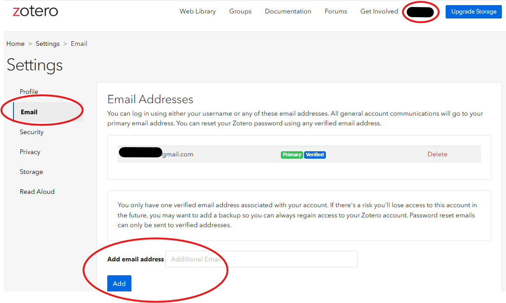
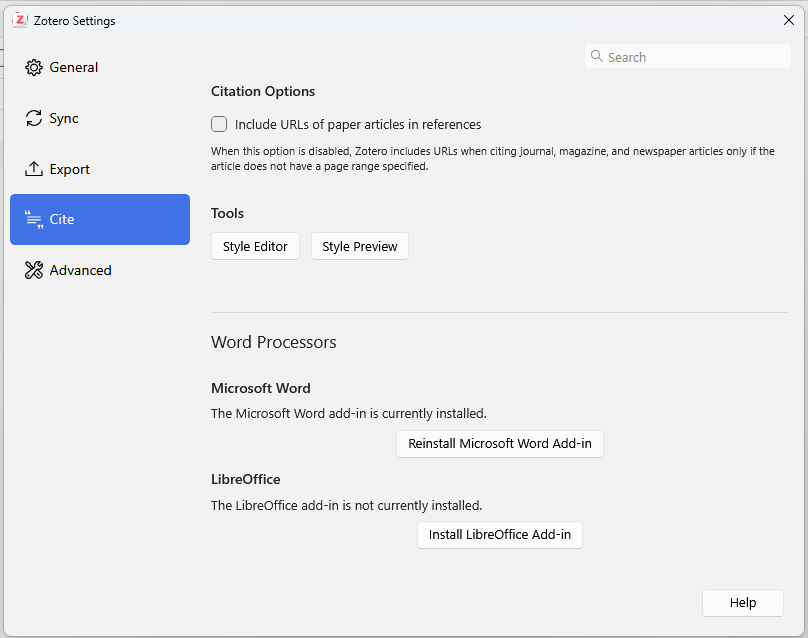
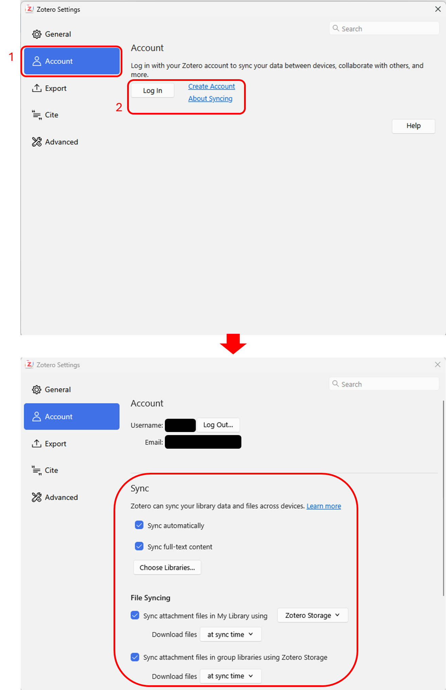
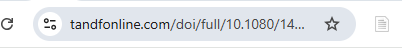

This is the source that most of the following material is obtained from:
<https://www.zotero.org/support/>

# Getting started (Pre-workshop Tasks)

## Register for a free account

If you haven’t already created a Zotero account, please take a few
moments to register for a free account
[here](https://www.zotero.org/user/register). It is recommended to use
your personal email rather than your UBC email to create an account. The
reason is that for some folks, you will eventually lose access to your
UBC email and then it is hard to access your account. If you have
already used ubc email to create an account, you can add your personal
email as a backup. Password reset emails can only be sent to verified
addresses on your Zotero account. To add backup email, go to your Zotero
online account, click on your username and select settings. Then on the
left pane select “Email” and add your backup email.

## Installation instructions

### Zotero Desktop app

Download and install the Zotero desktop app on the [Zotero download
page](https://www.zotero.org/download/). The Zotero Desktop app is
required when inserting and managing in-text citations and
bibliographies in Microsoft Word. However, even without the desktop app,
you can still log in to your Zotero online account to access and manage
your online library. Your online library can be synchronized with the
Zotero Desktop app whenever it is installed and connected.

### Zotero Connector

You also need to [install the Zotero
Connector](https://www.zotero.org/download) for your browser which is
available for Chrome, Firefox, Edge, or Safari (The Zotero Connector for
Safari is bundled with Zotero. You can enable it from the Extensions
pane in the Safari settings).

### Word Processor Plugins Installation

Zotero has available plugins for [Microsoft
Word](https://www.zotero.org/support/word_processor_plugin_usage),
[LibreOffice](https://www.zotero.org/support/libreoffice_writer_plugin_usage),
and [Google Docs](https://www.zotero.org/support/google_docs) which
allow you to create dynamic bibliographies and insert an in-text
citation in your manuscript.

The word processor plugins are bundled with Zotero Desktop App and
should be installed automatically for each [supported word
processor](https://www.zotero.org/support/system_requirements#word_processors)
on your computer when you first start Zotero. If you have just installed
the Zotero Desktop App, it will usually appear the next time you open
Microsoft Word. If it does not, close both the Zotero Desktop App and
Microsoft Word, then restart your computer. In most cases, after
restarting, the Zotero tab will appear in the Word ribbon and function
correctly.

You can reinstall the plugins later from the Cite -\> Word Processor
Plugins pane of the Zotero preferences. If you’re having trouble, see
[Manually Installing the Zotero Word Processor
Plugin](https://www.zotero.org/support/word_processor_plugin_manual_installation)
or [Word Processor Plugin
Troubleshooting](https://www.zotero.org/support/word_processor_plugin_troubleshooting).

### Optional Step: Zotero Mobile App

Optionally, you can also install the [Zotero mobile
app](https://www.zotero.org/download/#), available for both
[iOS](https://apps.apple.com/us/app/zotero/id1513554812) and
[Android](https://play.google.com/store/apps/details?id=org.zotero.android)
devices.

# Syncing

While Zotero stores all data locally on your computer by default,
Zotero’s sync functionality allows you to access your Zotero library on
any computer with internet access. Zotero syncing has two parts: data
syncing and file syncing.

## Data Syncing[\#](https://www.zotero.org/support/sync#data_syncing)

Data syncing merges library items, notes, links, tags, etc. — everything
except attachment files — between your local computer and the Zotero
servers, allowing you to work with your data from any computer with
Zotero installed and to view your library online on zotero.org. Data
syncing is free and unlimited, and it can be used without file syncing.

The first step to syncing your Zotero library is to login to your Zotero
account (create an account if you don’t have it already). Then, open the
Sync pane of the [<u>Zotero
preferences</u>](https://www.zotero.org/support/preferences) and enter
your login information in the Data Syncing section.

By default, Zotero will sync your local data with the Zotero servers
whenever changes are made. To disable automatic syncing, uncheck the
“Sync automatically” checkbox in this section. You can sync manually at
any time by clicking the “Sync with zotero.org” button
() on the top right-hand side
of the Zotero toolbar.

When Zotero syncs, it automatically applies changes in both directions —
any changes you make in one place will be applied to all other synced
computers. If an item has changed in multiple places in conflicting ways
between syncs, you’ll receive a conflict resolution dialog asking which
version you’d like to keep. If you find yourself using a new computer,
you can simply set up syncing and Zotero will automatically download all
data from your online library.

## **File Syncing[\#](https://www.zotero.org/support/sync#file_syncing)**

Data syncing syncs library items, but doesn’t sync attached files (PDFs,
audio and video files, images, etc.). To sync these files, you can
[<u>set up file
syncing</u>](https://www.zotero.org/support/preferences/sync#file_syncing)
to accompany data syncing, using either Zotero Storage or WebDAV.

### **Zotero Storage[\#](https://www.zotero.org/support/sync#zotero_storage)**

Zotero Storage is the recommended file sync option. It has several
advantages over WebDAV syncing, including syncing of files in [group
libraries](https://www.zotero.org/support/groups), web-based access to
PDFs and other attachments, easier setup, guaranteed compatibility, and
improved upload performance for certain files. Each Zotero user is given
300 MB of free Zotero Storage for attached files, with [larger storage
plans](https://www.zotero.org/support/storage#storage_pricing) available
for purchase.

However, if you want to bypass the 300 MB free limit without paying for
a premium plan, you can use [linked attachments
option](https://www.zotero.org/support/preferences/advanced#linked_attachment_base_directory)
(instead of stored files) or install a third-party plugin like
[ZotMoov](https://github.com/wileyyugioh/zotmoov). Instead of uploading
PDFs to Zotero's servers, this method automatically renames and moves
your files into a local folder synced by your own cloud service (such as
Google Drive, OneDrive, or Dropbox). Because Zotero only needs to sync
lightweight text citations rather than bulky PDFs, you can expand your
library indefinitely using the free storage you already own.

# Adding Items to Your Zotero Library

This section describes the various ways to add items (including books,
journal articles, web pages, etc.) as items in Zotero.

## Using Zotero Connector via your web browser

For this you need to [install the Zotero
Connector](https://www.zotero.org/download) for Chrome, Firefox, Edge,
or Safari, in addition to the Zotero desktop app.

The Zotero Connector’s save button is the most convenient and reliable
way to add items with high-quality bibliographic metadata to your Zotero
library. As you browse the web, the Zotero Connector will automatically
find bibliographic information on webpages you visit and allow you to
add it to Zotero with a single click.

For example, if you’re on the main page for a journal article, the save
button will change to the icon of a journal article
(circled in red):

On a library catalog entry for a book, the save button will show a book
icon:

<img src="images/aaad326ebdfb8413cfbc16cb482c4142e4f34a16.png"
