This is the source that most of the following material is obtained from:
<https://www.zotero.org/support/>

# Getting started (Pre-workshop Tasks)

## Register for a free account

If you haven’t already created a Zotero account, please take a few
moments to register for a free account
[here](https://www.zotero.org/user/register). It is recommended to use
your personal email rather than your UBC email to create an account. The
reason is that for some folks, you will eventually lose access to your
UBC email and then it is hard to access your account. If you have
already used ubc email to create an account, you can add your personal
email as a backup. Password reset emails can only be sent to verified
addresses on your Zotero account. To add backup email, go to your Zotero
online account, click on your username and select settings. Then on the
left pane select “Email” and add your backup email.

## Installation instructions

### Zotero Desktop app

Download and install the Zotero desktop app on the [Zotero download
page](https://www.zotero.org/download/). The Zotero Desktop app is
required when inserting and managing in-text citations and
bibliographies in Microsoft Word. However, even without the desktop app,
you can still log in to your Zotero online account to access and manage
your online library. Your online library can be synchronized with the
Zotero Desktop app whenever it is installed and connected.

### Zotero Connector

You also need to [install the Zotero
Connector](https://www.zotero.org/download) for your browser which is
available for Chrome, Firefox, Edge, or Safari (The Zotero Connector for
Safari is bundled with Zotero. You can enable it from the Extensions
pane in the Safari settings).

### Word Processor Plugins Installation

Zotero has available plugins for [Microsoft
Word](https://www.zotero.org/support/word_processor_plugin_usage),
[LibreOffice](https://www.zotero.org/support/libreoffice_writer_plugin_usage),
and [Google Docs](https://www.zotero.org/support/google_docs) which
allow you to create dynamic bibliographies and insert an in-text
citation in your manuscript.

The word processor plugins are bundled with Zotero Desktop App and
should be installed automatically for each [supported word
processor](https://www.zotero.org/support/system_requirements#word_processors)
on your computer when you first start Zotero. If you have just installed
the Zotero Desktop App, it will usually appear the next time you open
Microsoft Word. If it does not, close both the Zotero Desktop App and
Microsoft Word, then restart your computer. In most cases, after
restarting, the Zotero tab will appear in the Word ribbon and function
correctly.

You can reinstall the plugins later from the Cite -\> Word Processor
Plugins pane of the Zotero preferences. If you’re having trouble, see
[Manually Installing the Zotero Word Processor
Plugin](https://www.zotero.org/support/word_processor_plugin_manual_installation)
or [Word Processor Plugin
Troubleshooting](https://www.zotero.org/support/word_processor_plugin_troubleshooting).

### Optional Step: Zotero Mobile App

Optionally, you can also install the [Zotero mobile
app](https://www.zotero.org/download/#), available for both
[iOS](https://apps.apple.com/us/app/zotero/id1513554812) and
[Android](https://play.google.com/store/apps/details?id=org.zotero.android)
devices.

# Syncing

While Zotero stores all data locally on your computer by default,
Zotero’s sync functionality allows you to access your Zotero library on
any computer with internet access. Zotero syncing has two parts: data
syncing and file syncing.

## Data Syncing[\#](https://www.zotero.org/support/sync#data_syncing)

Data syncing merges library items, notes, links, tags, etc. — everything
except attachment files — between your local computer and the Zotero
servers, allowing you to work with your data from any computer with
Zotero installed and to view your library online on zotero.org. Data
syncing is free and unlimited, and it can be used without file syncing.

The first step to syncing your Zotero library is to login to your Zotero
account (create an account if you don’t have it already). Then, open the
Sync pane of the [<u>Zotero
preferences</u>](https://www.zotero.org/support/preferences) and enter
your login information in the Data Syncing section.

By default, Zotero will sync your local data with the Zotero servers
whenever changes are made. To disable automatic syncing, uncheck the
“Sync automatically” checkbox in this section. You can sync manually at
any time by clicking the “Sync with zotero.org” button
() on the top right-hand side
of the Zotero toolbar.

When Zotero syncs, it automatically applies changes in both directions —
any changes you make in one place will be applied to all other synced
computers. If an item has changed in multiple places in conflicting ways
between syncs, you’ll receive a conflict resolution dialog asking which
version you’d like to keep. If you find yourself using a new computer,
you can simply set up syncing and Zotero will automatically download all
data from your online library.

## **File Syncing[\#](https://www.zotero.org/support/sync#file_syncing)**

Data syncing syncs library items, but doesn’t sync attached files (PDFs,
audio and video files, images, etc.). To sync these files, you can
[<u>set up file
syncing</u>](https://www.zotero.org/support/preferences/sync#file_syncing)
to accompany data syncing, using either Zotero Storage or WebDAV.

### **Zotero Storage[\#](https://www.zotero.org/support/sync#zotero_storage)**

Zotero Storage is the recommended file sync option. It has several
advantages over WebDAV syncing, including syncing of files in [group
libraries](https://www.zotero.org/support/groups), web-based access to
PDFs and other attachments, easier setup, guaranteed compatibility, and
improved upload performance for certain files. Each Zotero user is given
300 MB of free Zotero Storage for attached files, with [larger storage
plans](https://www.zotero.org/support/storage#storage_pricing) available
for purchase.

However, if you want to bypass the 300 MB free limit without paying for
a premium plan, you can use [linked attachments
option](https://www.zotero.org/support/preferences/advanced#linked_attachment_base_directory)
(instead of stored files) or install a third-party plugin like
[ZotMoov](https://github.com/wileyyugioh/zotmoov). Instead of uploading
PDFs to Zotero's servers, this method automatically renames and moves
your files into a local folder synced by your own cloud service (such as
Google Drive, OneDrive, or Dropbox). Because Zotero only needs to sync
lightweight text citations rather than bulky PDFs, you can expand your
library indefinitely using the free storage you already own.

# Adding Items to Your Zotero Library

This section describes the various ways to add items (including books,
journal articles, web pages, etc.) as items in Zotero.

## Using Zotero Connector via your web browser

For this you need to [install the Zotero
Connector](https://www.zotero.org/download) for Chrome, Firefox, Edge,
or Safari, in addition to the Zotero desktop app.

The Zotero Connector’s save button is the most convenient and reliable
way to add items with high-quality bibliographic metadata to your Zotero
library. As you browse the web, the Zotero Connector will automatically
find bibliographic information on webpages you visit and allow you to
add it to Zotero with a single click.

For example, if you’re on the main page for a journal article, the save
button will change to the icon of a journal article
(circled in red):

On a library catalog entry for a book, the save button will show a book
icon:

Clicking the save button will create an item in Zotero with the
information it has identified.

On many sites, Zotero will also save any PDF accessible from the page or
an open-access PDF that can be found for the saved item.

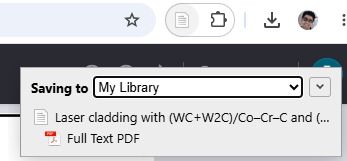

### Generic Webpages

If you click the save button on webpages, Zotero will import the page as
a “Web Page” item with a title, URL, access date and snapshot. Zotero
can archive a webpage by creating a snapshot — an offline file
reflecting the state of the page at the time the snapshot was taken.

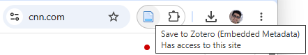

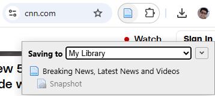

If the Zotero Connector does not recognize data on a page, you can save
the page as a Web Page item with an attached snapshot by clicking the
Zotero save button in the browser toolbar. You can also take a snapshot
of any page by right-clicking (click-and-hold in Safari) on the Zotero
save button and choosing “Save to Zotero (Web Page with Snapshot)”.

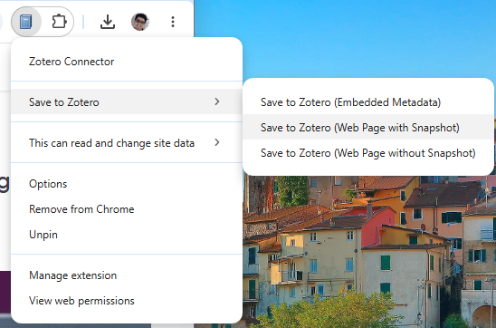

By default, Zotero will save snapshots when importing items from
webpages. You can disable this setting in the [<u>Zotero
preferences</u>](https://www.zotero.org/support/preferences/general).

Such snapshots and PDFs are stored as copies in [<u>Zotero data
directory</u>](https://www.zotero.org/support/zotero_data), and appear
as child items of the saved item.

### PDFs

If you are viewing a PDF file in your browser, the save button will show
a PDF icon. Clicking this button will import the PDF file alone into
your library and then automatically attempt to [<u>retrieve
metadata</u>](https://www.zotero.org/support/retrieve_pdf_metadata)
about it. While this will often produce good results, it is usually
better to use the save button from the publication’s abstract page or
catalog entry, as described above, if there is one.

If you save a PDF directly and Zotero isn’t able to retrieve metadata,
it will leave the PDF as a standalone attachment. To add metadata,
you’ll need to create a parent item, either by saving a regular
bibliographic item and dragging the PDF on top of it or by
right-clicking on the PDF, choosing Create Parent Item, and entering an
identifier such as a DOI or ISBN. If all else fails, you can click
Manual Entry after selecting Create Parent Item and manually enter
metadata for the item.

### **Multiple Web Search Results**

On some webpages that contain information about multiple items (e.g., a
list of Google Scholar search results), the save button will show a
folder icon. Clicking this folder icon will open a window where you can
select the items that you want to save to Zotero:

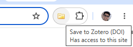

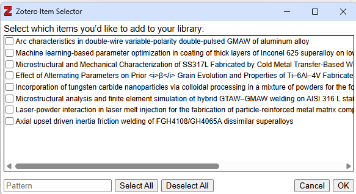

### **Saving to a Specific Collection or Library**

After you click the save button, a popup will appear indicating which
Zotero collection the item is being saved to. If you want to save the
item to a different collection or library, you can change the selection
there, as well as enter tags to assign to the new item.

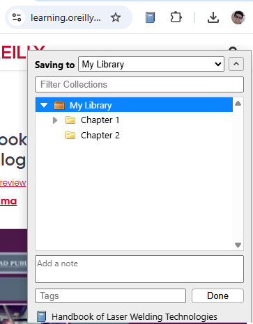

### **Data Quality and Choosing a Translator**

The quality of the data Zotero imports is determined by the information
supplied on the webpage. Some websites include high-quality data for
tools like Zotero in the page itself (“embedded metadata”). Other
websites provide only limited metadata (e.g., only the title of a blog
post) or no metadata at all. For many sites, Zotero has website-specific
“translators” to obtain the best quality metadata. Zotero recognizes
almost all library catalogs, most news sites, research databases, and
scientific publishers. (For more information, see Zotero’s
[<u>compatible websites
list</u>](https://www.zotero.org/support/translators).) Metadata for the
same item may vary in quality across sites providing it. For example,
importing an item from the publisher’s website will generally yield much
better data than importing from Google Scholar.

Zotero will generally choose the best translator available for each site
automatically. You can choose an alternative translator by
right-clicking on the Zotero save button (or the page background in
Safari) and choosing one of the available options.

## Add Item by Identifier

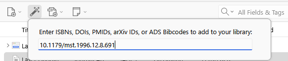

You can quickly add items to your library if you already know their
ISBN, DOI, PubMed ID, arXiv ID, or ADS Bibcode. Click the Add Item by
Identifier button
() in the toolbar, type or
paste in the identifier, and press Enter/Return on your keyboard. To add
more than one item, separate identifiers by spaces, commas, or line
breaks.

To look up metadata, Zotero uses Library of Congress,
[<u>WorldCat</u>](http://www.worldcat.org/), and other catalogs for
ISBNs, [<u>CrossRef</u>](http://www.crossref.org/) and other registries
for DOIs, [<u>NCBI PubMed</u>](http://www.ncbi.nlm.nih.gov/pubmed/) for
PubMed IDs, [<u>arXiv.org</u>](https://arxiv.org/) for arXiv IDs, and
[<u>ADS</u>](https://ui.adsabs.harvard.edu/) for ADS Bibcodes.

## Drag and Drop[\#](https://www.zotero.org/support/attaching_files#drag_and_drop)

Files can be copied into your library by dragging a file from your
operating system’s file browser into the Zotero window, and either
dropping it onto a collection in the left pane, or onto the center pane.
Files dropped onto an existing regular Zotero item in the center pane
are added as child items. Files dropped onto a collection, or in an
empty space or between items in the center pane, are added as standalone
items.

By default, files dragged into Zotero are added as **copies** of the
original files. To instead add **links** to the original files, hold
down Ctrl+Shift (Windows/Linux) or Cmd+Option (Mac) while dropping. (On
macOS, it may be necessary to allow the Zotero window to come to the
front before letting go for the modifier key to take effect.)

You can also drag and drop an existing standalone file item in Zotero
onto a regular Zotero item to create a child item.

### Stored Files

Files can be added to your Zotero library as either stored files or
linked files.

Stored files, which are the default, are stored within the [<u>Zotero
data directory</u>](https://www.zotero.org/support/zotero_data), and
Zotero will automatically manage them, including deleting them if you
delete the attachment item in Zotero. If you use [<u>file
syncing</u>](https://www.zotero.org/support/sync), Zotero will
automatically sync stored files between devices and make them available
in your online library on zotero.org. If you add a stored file from a
file on your computer, the file is copied to the Zotero data directory,
so you may wish to delete the original to avoid confusion.

To use stored files outside of Zotero, you can use Zotero’s search and
organization abilities to quickly find the relevant items and then
either drag the attachments straight from Zotero (e.g., into an email)
or right-click and choose Show File to view the files in your file
manager. If you prefer to find files without going through Zotero, you
can use your operating system’s search features (e.g., Spotlight on
macOS) or create a smart folder in your OS to show a list of all PDFs
within your Zotero data directory and interact with the files directly.
Zotero automatically renames files based on the parent item’s
bibliographic data, so you can easily find files by title, author, or
year even from outside Zotero.

### Linked Files

With linked files, Zotero only stores a link to the location of the
original file on your computer. Linked files are not synced, nor are
they deleted if the attachment item is deleted in Zotero. They also
can’t be used within a group library, as there’s no guarantee that other
group m embers would have access to the same file location. Linked files
are also not supported in the [<u>Zotero iOS
app</u>](https://apps.apple.com/us/app/zotero/id1513554812) or the
[<u>Android
app</u>](https://play.google.com/store/apps/details?id=org.zotero.android).

You can add a linked file by selecting an existing item and choosing
“Attach Link to File…” from the Add Attachment menu in the Zotero
toolbar or, to use [<u>PDF metadata
retrieval</u>](https://www.zotero.org/support/retrieve_pdf_metadata), by
selecting “Link to File…” from the New Item menu. You
can also use the appropriate OS-specific modifier key for linking files
while dragging in a file from the filesystem.

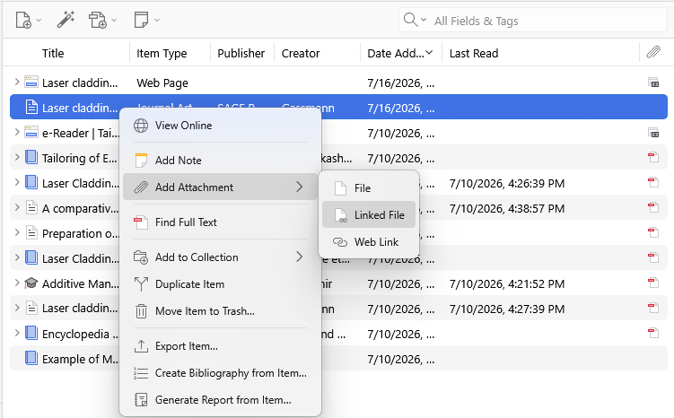

If you sync linked files using an external tool (Google Drive, etc.) for
use on multiple computers, it is a good idea to set the [<u>linked
attachment base
directory</u>](https://www.zotero.org/support/preferences/advanced#linked_attachment_base_directory)
so that the files can be found by Zotero on each computer even if the
containing folder is at a different location in the filesystem.

If you wish to convert linked files to stored files in order to allow
Zotero to manage them, you can do so from the Tools → Manage Attachments
menu.

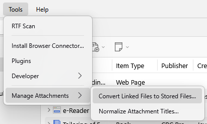

### Child versus Standalone Attachment Files

Files can be added either as *standalone items* or as *child items* to
regular Zotero bibliographic metadata items. It is generally always a
good idea to work with files as child items. Standalone files cannot be
used with many of Zotero’s features, including citing, My Publications,
and most types of searching, because they lack bibliographic metadata.

If you save a PDF directly to your library, Zotero will attempt to
[<u>retrieve
metadata</u>](https://www.zotero.org/support/retrieve_pdf_metadata) for
it and create a parent item automatically. If the item can’t be
recognized, you’ll be left with a standalone attachment. You can add a
parent by either [<u>saving an item from the
web</u>](https://www.zotero.org/support/adding_items_to_zotero) and
dragging the PDF on top of it (if a PDF isn’t attached automatically) or
by right-clicking on the PDF, choosing Create Parent Item, and entering
an identifier such as a DOI or ISBN. If all else fails, you can click
Manual Entry after selecting Create Parent Item and manually enter
metadata for the item.

#### **Attachment Menu[\#](https://www.zotero.org/support/attaching_files#attachment_menu)**

When you have selected a single item in the center pane, you can click
the “Add Attachment” button at the top of the center column. Select
either “Attached Stored Copy of File…” or “Attach Link to File…” to add
files as attachments to the item.

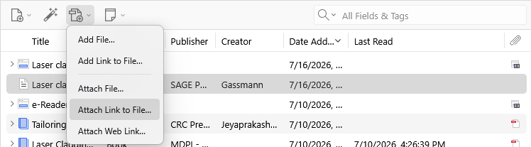

You can also “Attach Link to URI…” to add a link to a web page
(<http://> or <https://>) or to another program on your computer (e.g.,
OneNote <onenote://> or Evernote evernote://).

These options are also available when you right-click an item and choose
“Add Attachment”.

## **Manually Adding Items[\#](https://www.zotero.org/support/adding_items_to_zotero#manually_adding_items)**

Zotero is designed to help you avoid manual entry whenever possible,
however if you really need to add something manually — for example, a
source that isn’t available anywhere online — you can do so by clicking
“New Item”
(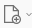) button at the top of the
middle pane and selecting the desired item type from the drop-down menu.
An empty item of the selected item type will now appear in the center
column. You can then manually enter the item’s bibliographic information
via the right-hand pane.

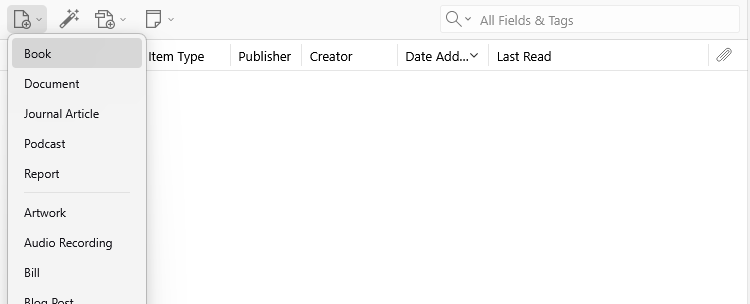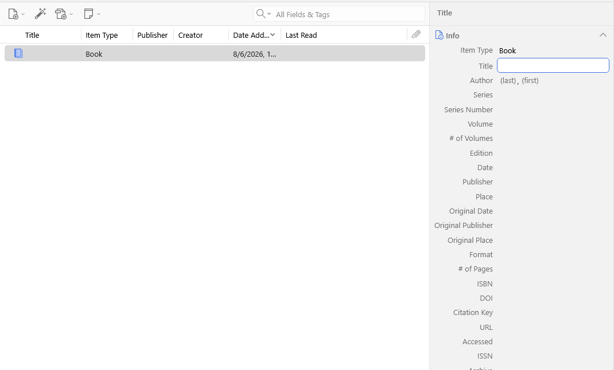

**Note:** Since it’s almost always better to visit a webpage in your
browser and use the “Save to Zotero” button, the Web Page item type is
not included in the “New Item” menu. However, if you really want to
create a webpage item by hand, you create an empty item of another type
and switch the item type to Web Page in the right-hand pane.

## **Accessing Files[\#](https://www.zotero.org/support/attaching_files#accessing_files)**

Files in your library can be accessed by double-clicking the item in the
center pane. Alternatively, you can right-click the item and select
“View PDF” or “View File”.

To locate a stored (copied) or linked file, right-click the item in the
Zotero pane and select “Show File”. Copied files are stored in the
[<u>Zotero data
directory</u>](https://www.zotero.org/support/zotero_data), and each
file has its own subdirectory, which is named with a random 8-character
string.

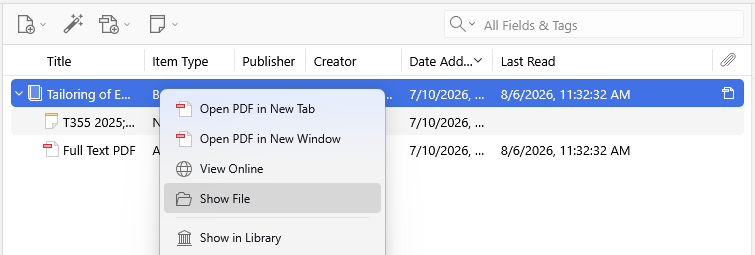

## Feeds

Feeds are a great way to discover new research. With feeds, you can
subscribe to updates from a journal, website, publisher, institution,
research group, or other source and quickly find new articles or works.
If you find an item in a publication’s feed that you want to save and
read further, you can add it to your Zotero library with the click of a
button.

### **Subscribing to Feeds[\#](https://www.zotero.org/support/feeds#subscribing_to_feeds)**

To subscribe to a feed, click File --\> New Feed in the Zotero Menu bar.
You can add feeds in two ways. First, you can add a feed using the URL
provided on the journal’s (or other source’s) website. For journals,
these are usually available from the journal homepage. Look for the RSS
icon () or search for the journal
name and “RSS feed” in a search engine. Many publishers place the RSS
icon next to social media buttons or email alert links.

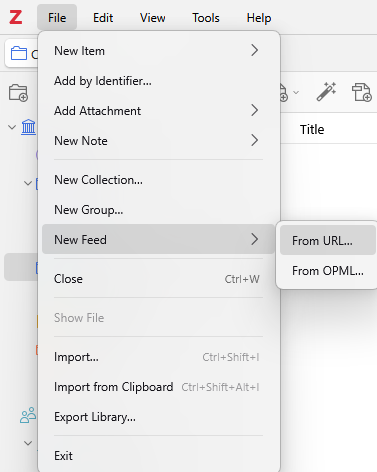

Once you’ve found the RSS feed URL for your source, click the Add Feed
menu, then choose “From URL…”. The Add Feed window will open. Paste the
RSS feed URL to the URL text field. If the URL is for a valid feed, you
will be able to enter a title for the feed and click “Save”. You can
click “Advanced Options” to adjust how frequently a feed updates and to
set how long read and unread items are kept in a feed before being
removed.

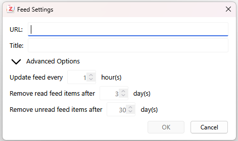

You can also import a set of feeds using an OPML file (e.g., from a list
of subscriptions exported from Feedly or other RSS Reader services). To
import an OPML file, choose “From OPML…” from the Add Feed menu.

### **Reading Feeds[\#](https://www.zotero.org/support/feeds#reading_feeds)**

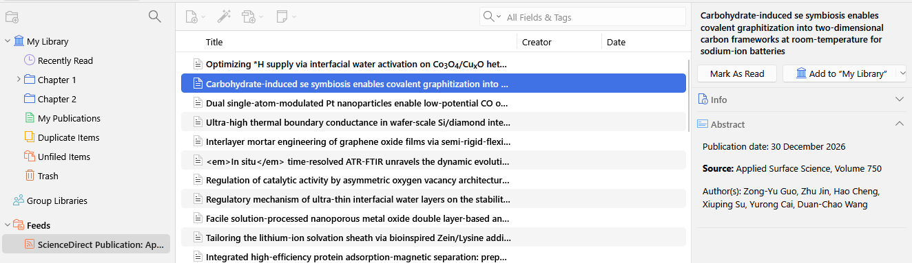

Feeds you have subscribed to will appear at the bottom of the left pane
of the Zotero window, below My Library and your Group Libraries and
above the tag selector. Click on a feed to view currently available
items in the feed. Right-click on a feed to manually refresh it, mark
all items in the feed as read, modify feed settings, or unsubscribe from
the feed.

When viewing a feed, unread items will be shown in bold text, while read
items are shown in regular text. When you select an item in the feed,
you can mark it as read or unread by clicking the “Mark As Unread/Read”
button or pressing the \` key. Save the item to your Zotero library by
clicking on the “Save to My Library” button or pressing
Ctrl/Cmd-Shift-S. You can save a feed item to a group library by
clicking the dropdown arrow on the right side of the “Save to My
Library” button and choosing the group library.

*Note, the read/unread state of items is not synced across computers
when using Zotero sync.*

# Organizing and Taking Notes

Items in Zotero libraries can be organized with collections (the name
Zotero gives to folders) and tags.

Collections allow hierarchical organization of items into groups and
subgroups. The same item can belong to multiple collections and
subcollections in your library at the same time. Collections are useful
for filing items in meaningful groups (e.g., items for a particular
project, from a specific source, on a specific topic, or for a
particular course). You can import items directly to a specific
collection or add them to collections after they are already in your
library.

Tags (often called “keywords” in other contexts) allow for detailed
characterization of an item. You can tag items based on their topics,
methods, status, ratings, or even based on your own workflow (e.g.,
“to-read”). Items can have as many tags as you like, and you can filter
your library (or a specific collection) to show items having a specific
set of one or more tags.

Tags are portable, but collections are not. Copying items between Zotero
libraries (My Library and group libraries) will transfer their tags, but
not their collection placements. Both organizational methods have unique
advantages and features. Experiment with both to see what works best for
your own workflow.

## **Collections[\#](https://www.zotero.org/support/collections_and_tags#collections)**

It is important to understand that items can belong to multiple
collections and subcollections. Adding an item to multiple collections
does not duplicate the item. In this sense, collections are more like
music playlists than folders in your computer filesystem. Just as a
single song can be added to more than one playlist, a single item in a
Zotero library can be added to multiple collections.

### **Creating Collections[\#](https://www.zotero.org/support/collections_and_tags#creating_collections)**

Click the “New Collection…” button
() above the left pane in
Zotero to add a new collection. You can also right-click on “My Library”
or the name of a Group library and choose “New Collection…” to add a new
collection. The new collection will appear as a folder under “My
Library” or the selected Group library.

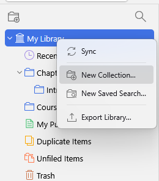

Subcollections can be created by dragging and dropping an existing
collection onto another collection or by right-clicking a collection and
choosing “New Subcollection…”. You can convert a subcollection into a
top-level collection by dragging it to the library root (e.g., “My
Library”).

You can drag collections between Zotero libraries in the left pane. If
you have editing privileges for the destination library, the collection
(and all of its items and subcollections) will be added to the
destination library.

### **Adding Items to Collections[\#](https://www.zotero.org/support/collections_and_tags#adding_items_to_collections)**

New items are automatically saved into the collection selected at the
time. When saving from the browser, you can choose a different
collection from the popup after clicking the save button.

To add existing items in your library to a collection, select them in
the center pane and drag them onto the collection in the left pane. By
default, the items will be added to the new collection but won’t be
removed from their original location.

To *move* items between collections, hold down Cmd (Mac) or Shift
(Windows/Linux) when dragging items to the new collection. Remember that
the “My Library” view always shows all items in your library, so you
cannot “move” items out of this view. To see only items that do not
belong to any collection in your library, open the [<u>Unfiled
Items</u>](https://www.zotero.org/support/collections_and_tags#unfiled_items)
special collection.

### **Renaming Collections[\#](https://www.zotero.org/support/collections_and_tags#renaming_collections)**

Right-click on the collection and choose “Rename Collection…” to give a
collection a new name. Collections are sorted alphabetically in your
library. You can use punctuation marks to sort collections to the top of
the list.

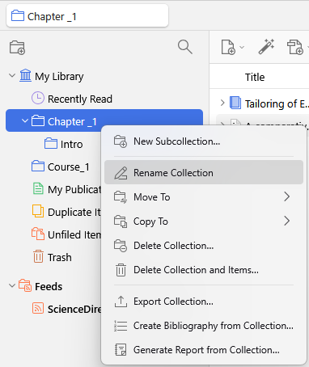

### **Deleting Collections[\#](https://www.zotero.org/support/collections_and_tags#deleting_collections)**

Right-click on the collection and choose “Delete Collection…” to remove
a collection from your library. Deleting a collection **does not
delete** the items in the collection. Items are still accessible by
clicking on My Library or the Group library name.

Deleting a collection will also delete its subcollections (but not the
items in them).

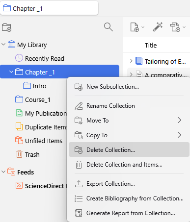

To delete both the collection and its items, right-click on the
collection and choose “Delete Collection and Items…”.

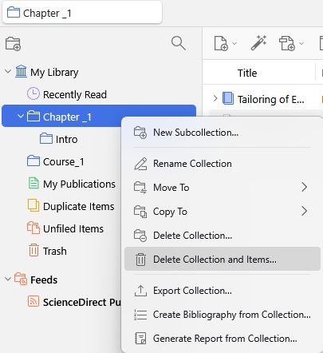

### **Removing Items from a Collection[\#](https://www.zotero.org/support/collections_and_tags#removing_items_from_a_collection)**

Select a collection in the left Zotero pane, then select the items in
the center pane that you want to remove from the collection. Press the
Delete key to remove the items from the collection. You can also
right-click the selected items and choose “Remove Item(s) from
Collection…”. This only removes the items from the selected collection,
not from “My Library” or any other collections.

To *delete* an item in a collection, select the items in the collection,
right-click on them, and choose “Move Item(s) to Trash…”. When “My
Library” or a Group library name is selected in the left Zotero pane,
pressing the Delete key will also move items to the trash. When a
collection or subcollection is selected, press Cmd/Ctrl-Delete to move
the items directly to the trash.

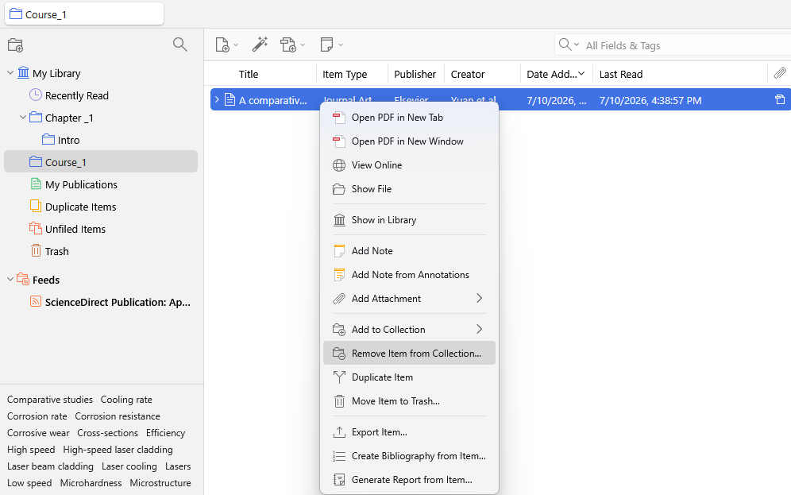

### **Identifying Collections an Item is In[\#](https://www.zotero.org/support/collections_and_tags#identifying_collections_an_item_is_in)**

Zotero 7 and higher versions include a section in the item pane showing
a list of collections an item is in. You can also select the item and
then hold down the Option key (macOS), Control key (Windows), or Alt
(Zotero 6)/Ctrl (Zotero 7) key (Linux). This will highlight all
collections that contain the selected item.

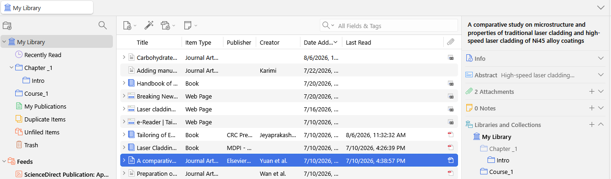

### **Saved Searches[\#](https://www.zotero.org/support/collections_and_tags#saved_searches)**

[<u>Saved
Searches</u>](https://www.zotero.org/support/searching#saved_searches)
are like smart collections. They automatically update to include all the
items in your library that meet the search criteria. For example, you
can create a “To Read” Saved Search with the criteria Tag is not read.
Then, opening the Saved Search will show you all of the items in your
library that you haven’t read yet (i.e., the ones without a “read” tag).
To mark an item as read, add the “read” tag to it.

| 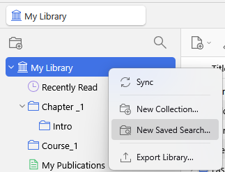 | 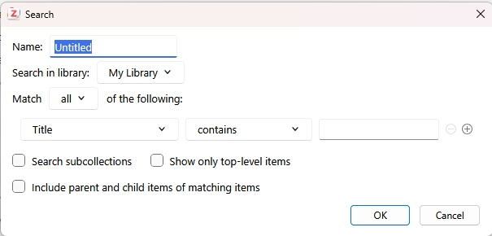 |
|----|----|

### 

### **Special Collections[\#](https://www.zotero.org/support/collections_and_tags#special_collections)**

Zotero has four special collections: “My Publications”, “Duplicate
Items”, “Unfiled Items”, and “Trash” which is listed on the left pane.

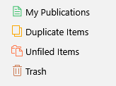

#### **My Publications[\#](https://www.zotero.org/support/collections_and_tags#my_publications)**

The [<u>My
Publications</u>](https://www.zotero.org/support/my_publications)
special collection allows you to create a list of your own work and
share it publicly on your profile page on Zotero.org. You can add notes
to each item and even share PDFs or other files under a license of your
choice.

To add an item, first add it to your library; then drag it from your
library to “My Publications” to launch the My Publication wizard. You’ll
be able to choose whether to include attached notes and files. Only add
work you yourself have created, and only include files if you have the
rights to distribute them publicly and wish to do so.

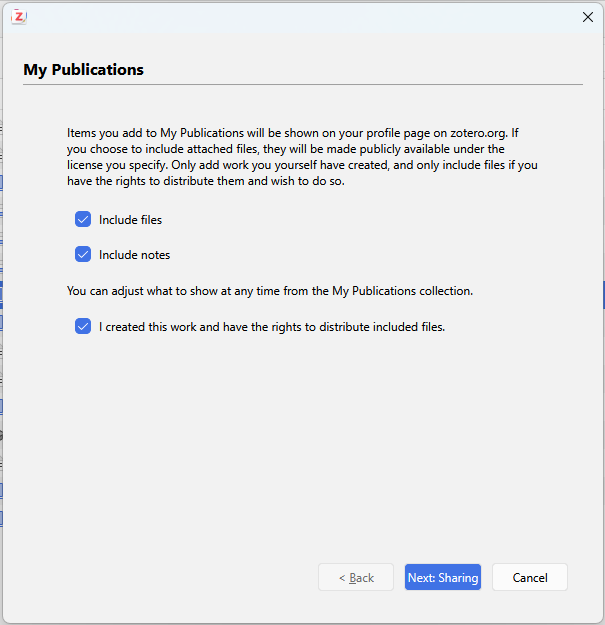

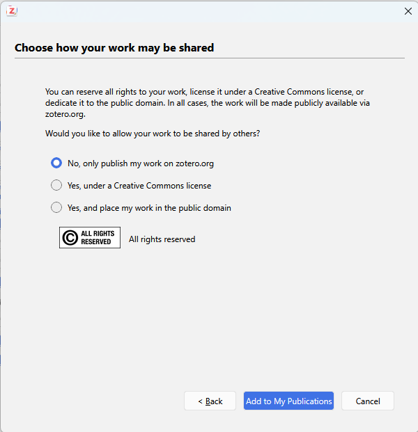

#### **Duplicate Items[\#](https://www.zotero.org/support/collections_and_tags#duplicate_items)**

The [<u>Duplicate
Items</u>](https://www.zotero.org/support/duplicate_detection) special
collection displays items that Zotero has identified as potential
duplicates. As you build your Zotero library, you may occasionally add
the same item more than once. For example, you might save the same item
twice from a webpage or import an item that is already in your library.
You can use this collection to review and merge duplicate items.

##### Finding Duplicates[\#](https://www.zotero.org/support/duplicate_detection#finding_duplicates)

Clicking on the “Duplicate Items” collection in your library will show
the items Zotero thinks are duplicates in the center pane.

Zotero currently uses the the title, DOI, and ISBN fields to determine
duplicates. If these fields match (or are absent), Zotero also compares
the years of publication (if they are within a year of each other) and
author/creator lists (if at least one author last name plus first
initial matches) to determine duplicates. The algorithm will be improved
in the future to incorporate other fields.

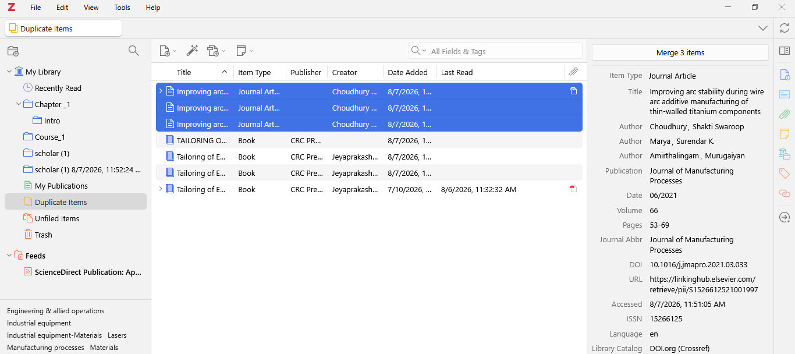

At this time, it is not possible to mark false positive matches as
non-duplicates. This functionality will be added in the future.

Note that duplicate detection only works *within a library*. Items in
different group libraries are [<u>separate
items</u>](https://www.zotero.org/support/groups#interact_with_groups_through_the_zotero_client).
They won’t show up in the “Duplicate Items” collection of any one of the
libraries.

##### Merging Duplicates[\#](https://www.zotero.org/support/duplicate_detection#merging_duplicates)

You should always resolve duplicate items by merging them, rather than
deleting one of the duplicates. Merges will retain all of the
collections and tags of the merged items; deleting one item will lose
these data. Merges are also automatically recognized by the [<u>word
processor
plugins</u>](https://www.zotero.org/support/word_processor_integration)
and don’t affect your automatically generated citations and
bibliographies.

To merge items in the “Duplicate Items” collection, select an item in
the center pane. Zotero will automatically co-select the other items
that it thinks are duplicates. Click the “Merge \<number\> Items” button
in the right pane to merge the items. If the item fields don’t match
completely, you can select one item to be the “master” from the list at
the top of the right pane, then select alternative versions of
mismatched fields using the icons to the right of each field.

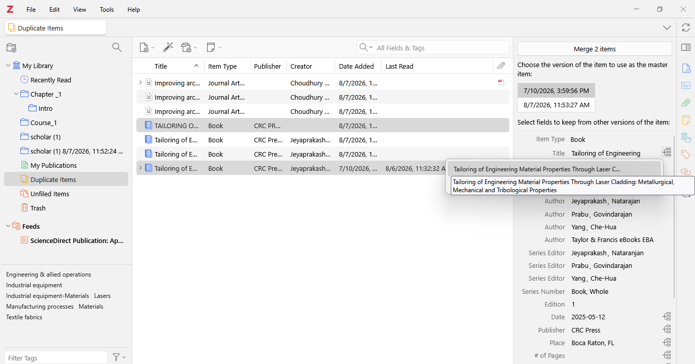

It may be easier to see which items are selected if you [<u>sort the
items by Title</u>](https://www.zotero.org/support/sorting). You can
select a single item in the “Duplicate Items” view by holding down
Alt/Option while clicking. You can de-select an item from a set of
duplicates by holding down Ctrl (Windows/Linux) or Cmd (Mac) while
clicking.

You can also select a group of two or more items *of the same item type*
anywhere in your Zotero library, right-click, and select “Merge Items…”
from the context menu.

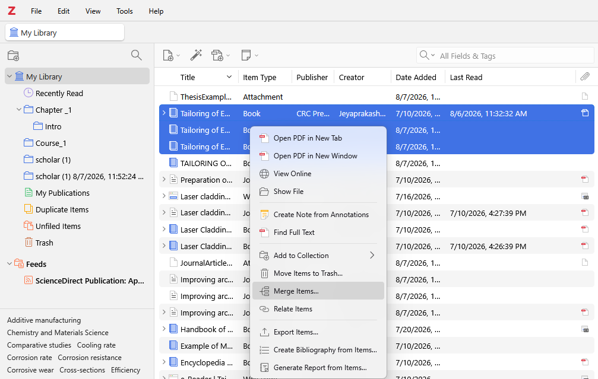

#### **Unfiled Items[\#](https://www.zotero.org/support/collections_and_tags#unfiled_items)**

Items that are not in any collection can be found in the “Unfiled Items”
special collection at the bottom of the collections list in the left
Zotero pane. If the “Unfiled Items” collection is not visible,
right-click on “My Library” or the Group library name and choose “Show
Unfiled Items”.

#### **Trash[\#](https://www.zotero.org/support/collections_and_tags#trash)**

When you delete an item by pressing Delete (Cmd/Ctrl-Delete in a
collection) or by right-clicking and choosing “Move Item(s) to Trash”,
they are moved to the Trash special collection. By default, items remain
in the Trash for 30 days (you can adjust this period in the [<u>General
pane</u>](https://www.zotero.org/support/preferences/general) of Zotero
preferences; Click Edit --\> Settings --\> General Pane), after which
they are deleted permanently. You can restore an item from the Trash to
your library by selecting it in the Trash and clicking the “Restore to
Library” button (or by right-clicking and choosing “Restore to
Library”). You can delete an item permanently by clicking the “Delete
Permanently…” button (or by right-clicking and choosing “Delete Item…”.

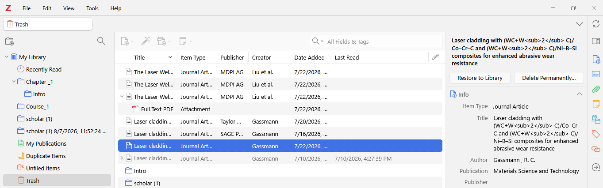Or

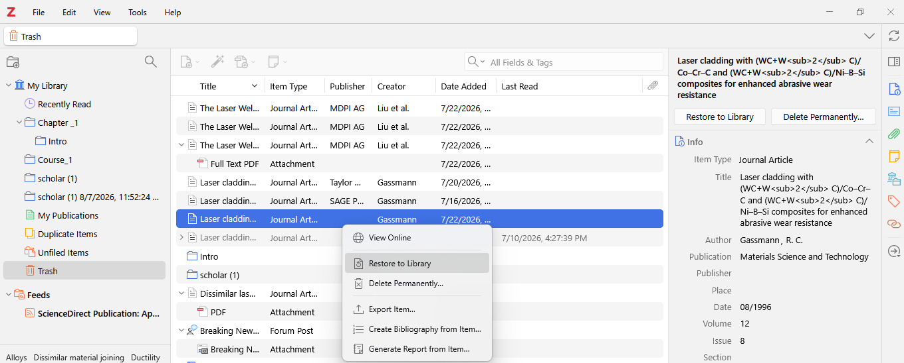

To update the preferences

| 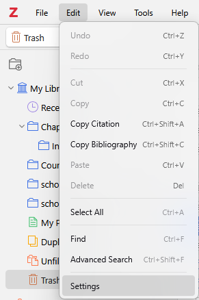 | 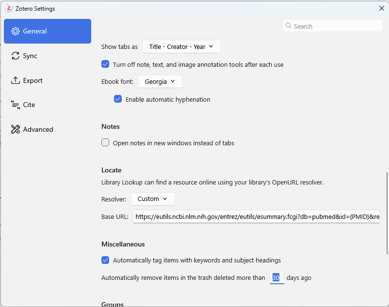 |
|----|----|

### **Show Items from Subcollections[\#](https://www.zotero.org/support/collections_and_tags#show_items_from_subcollections)**

By default, items added to a subcollection do not automatically appear
in parent collections. This can be changed by toggling “Show Items from
Subcollections” in the View menu. This setting is not currently
available in the online library.

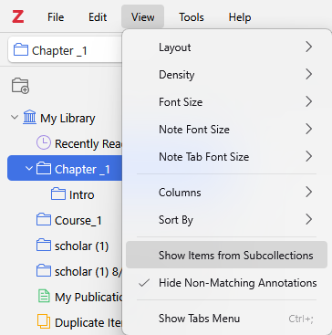

# Recently Read feature

Zotero added a Recently Read collection to the top of the collections
list. This is a virtual collection that shows the items in a library
with attachments you've opened in the last two weeks, most recent first.
It includes a Last Read column, which you can also add to other views if
you'd like to.\
\
Opening an attachment or changing pages will bump the item to the top of
the list. (Changing pages will only update its last-read time once every
few minutes.)\
\
This data syncs between devices, so you can quickly find a file on
another device that you've read elsewhere. We'll be adding this view to
the mobile apps soon.

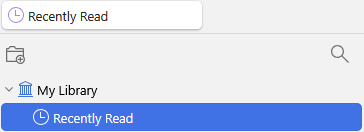

## **Tags[\#](https://www.zotero.org/support/collections_and_tags#tags)**

### **The Tag Selector[\#](https://www.zotero.org/support/collections_and_tags#the_tag_selector)**

The tag selector is located at the bottom of the left Zotero pane. It
shows all the tags that have been assigned to the items currently shown
in the center pane (i.e., items in the currently selected collection
that match the current search). To show all of the tags present in the
library, click the filter button
() in the lower-right corner
of the tag selection and choose “Display All Tags in This Library”. Tags
not assigned to currently shown items are greyed out. You can filter
items by their tags by clicking on one more tags in the tag selector.
Only items that have all of the selected tags will be shown in the
center pane. As you apply filters, the list of tags in the tag selector
will be updated to show only the tags assigned to currently visible
items. Clicking on a tag again will deselect it. To deselect all tags at
once, click the filter button and choose “Deselect All”.

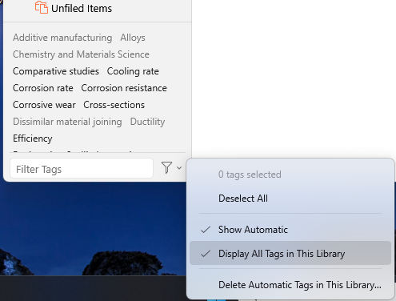

The filter box at the bottom of the tag selector can be used to search
for tags. Type in the search box to see all tags that match. To go back
to viewing all the tags in the collection, press the Escape key or click
the “X” button on the right side of the search box.

### **Adding Tags to Items[\#](https://www.zotero.org/support/collections_and_tags#adding_tags_to_items)**

To add a tag to an item, select the item in the center Zotero pane, and
then click the Tags icon in the right-hand pane. Click the Add button,
type the tag name, and type Enter/Return. You can rename a tag by
clicking on it and typing the new name. Once you have added the tag it
will also appear in the tag selector in the bottom left.

As you type, you will be shown a list of matching existing tags. You can
choose a suggested tag using the up and down arrow keys and insert it by
pressing Tab or Enter/Return on your keyboard.

You can also drag items to a tag in the tag selector in the bottom left
to quickly add the tag to all of those items.

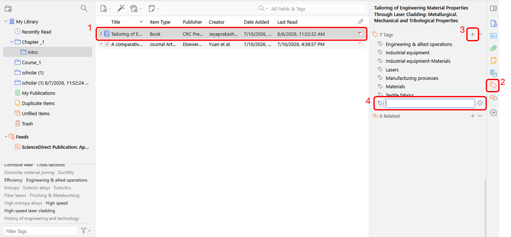

**Removing Tags from
Items[\#](https://www.zotero.org/support/collections_and_tags#removing_tags_from_items)**

To remove a tag from an item, select the item in the items list, click
the Tags tab in the right-hand pane, and click the “-” (minus) button
next to the tag you want to remove.

You can also hold Cmd (Mac) or Shift (Windows/Linux) while dragging
items to a tag in the tag selector in the bottom left to remove the tag
from all of those items.

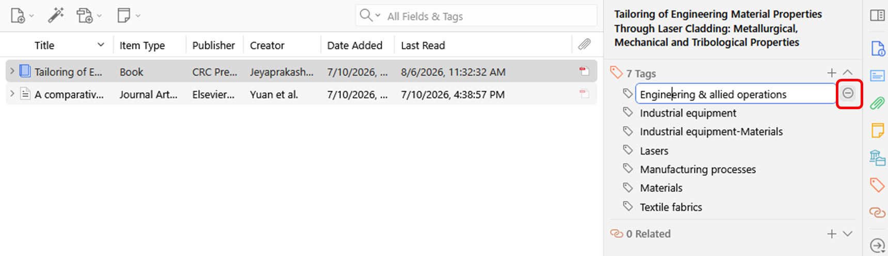

or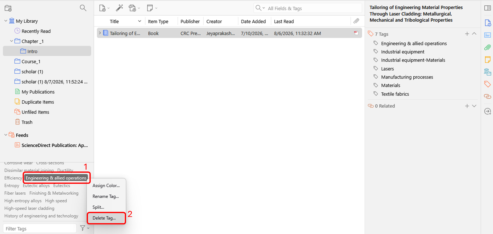

### Bulk Editing Tags[\#](https://www.zotero.org/support/collections_and_tags#bulk_editing_tags)

You can use the tag selector to globally rename and delete tags. To
rename a tag across all items it is assigned to, right-click the tag in
the tag selector and choose “Rename Tag…”. To delete a tag from all
items, right-click the tag and choose “Delete Tag…”. You can merge tags
by renaming one to have the same name as the other.

### **Emoji Tags[\#](https://www.zotero.org/support/collections_and_tags#emoji_tags)**

If you use an emoji in a tag, it will be displayed directly in the items
list.

### **Colored Tags[\#](https://www.zotero.org/support/collections_and_tags#colored_tags)**

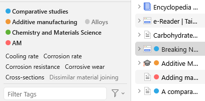

Colored tags appear as small colored squares next to items’ titles in
the center pane. Colored tags make it easy to quickly scan your library
for tags that have a certain tag. Colored tags are shown at the top of
the tag selector and are always visible, even if not assigned to any
visible items.

Some may use colored tags for “to read” or “favorite” items.

You can assign a color to a tag by right-clicking on it and choosing
“Assign Color…” In the popup window, select a color from the dropdown
box and click “Set Color”. You can remove a color from a tag by
right-clicking, choosing “Assign Color…”, and clicking “Remove Color”.

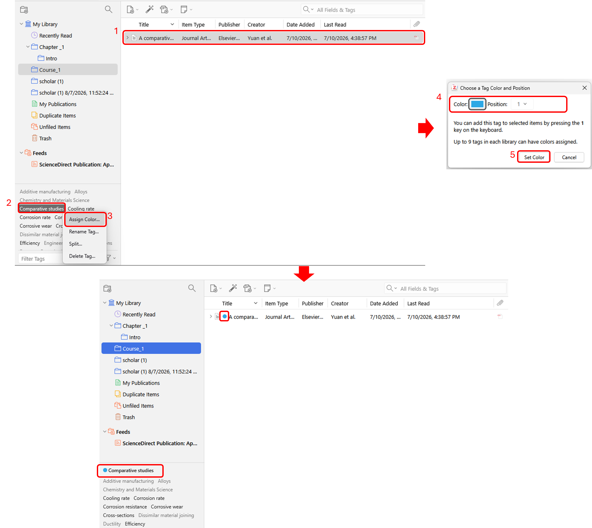

Each colored tag is also assigned a number, corresponding to its
position at the top of the tag selector. You can quickly add or remove a
colored tag from selected items by typing the corresponding number key
on your keyboard. You can change a colored tag’s number by
right-clicking on it, choosing “Assign Color…”, and choosing a new
position.

If you use an emoji in a colored tag, the emoji will be displayed
directly in place of the colored square. The tag will otherwise behave
like a colored tag, showing at the top of the tag selector and being
assignable with a number key. Up to 9 tags can be assigned colors and
numbers.

### **Automatic Tags[\#](https://www.zotero.org/support/collections_and_tags#automatic_tags)**

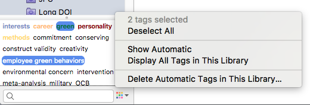

When items are saved to a Zotero library [<u>from the
web</u>](https://www.zotero.org/support/adding_items_to_zotero#web_translators),
tags are sometimes automatically added to items. For example, OPAC
library catalogs provide subject headings for their records, which are
saved as Zotero tags. Automatic tags behave the same as manually added
tags but are marked by a black icon in the “Tags” tab of the right-hand
Zotero pane (versus the blue icon for regular tags).

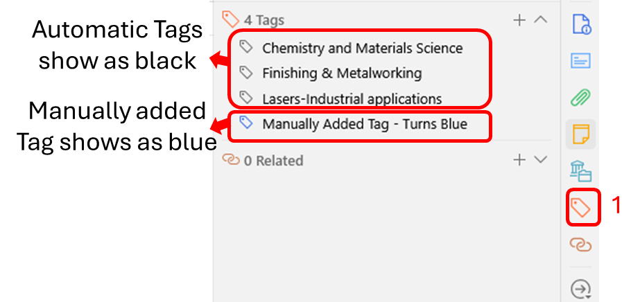

Automatic tags can be hidden from the tag selector by clicking the
multi-color button in the lower-right corner of the tag selector and
unchecking “Show Automatic”. You can delete all automatic tags from a
library by clicking “Delete Automatic Tags in This Library”.

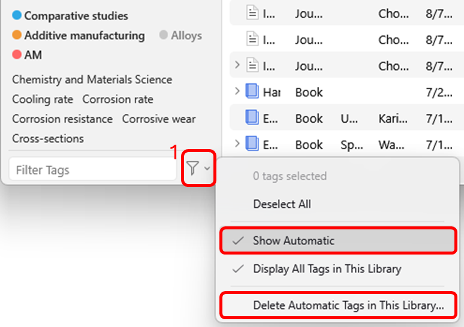

To prevent Zotero from adding automatic tags, uncheck “Automatically tag
items with keywords and subject headings” in the
[<u>General</u>](https://www.zotero.org/support/preferences/general)
pane of Zotero preferences.

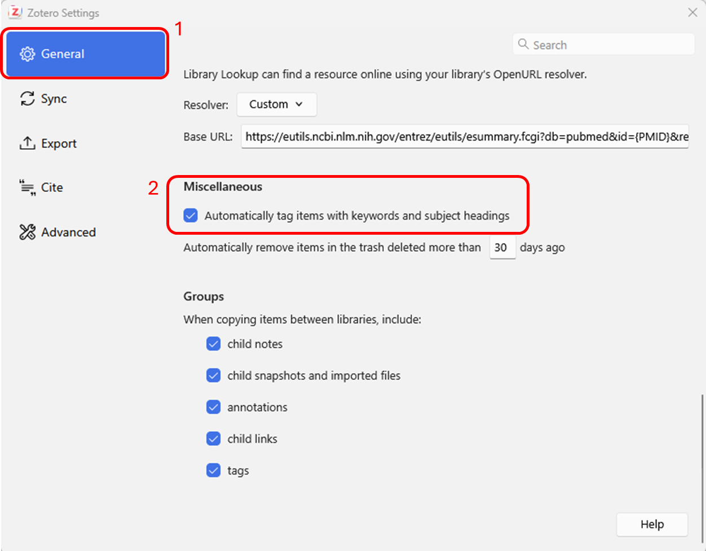

# **Searching**

## **Quick Search[\#](https://www.zotero.org/support/searching#quick_search)**

Quick searches provide a fast way to find items in a library or
collection.

### **Running a Quick Search[\#](https://www.zotero.org/support/searching#running_a_quick_search)**

To begin searching, click inside the search box at the top-right of the
center pane (or type Ctrl/Cmd-F) and start typing your search terms. As
you type, only those items in the center column that match the search
terms will remain.

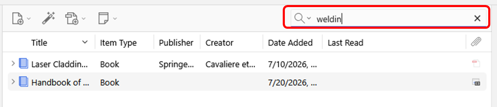

### **Quick Search Options[\#](https://www.zotero.org/support/searching#quick_search_options)**

Quick search can be used in three different modes:

- “Title, Year, Creator” - matches against these three fields, as well
  as publication titles

- “All Fields & Tags” - matches against all fields, as well as tags and
  text in notes

- “Everything” - matches against all fields, tags, text in notes, and
  indexed text in PDFs

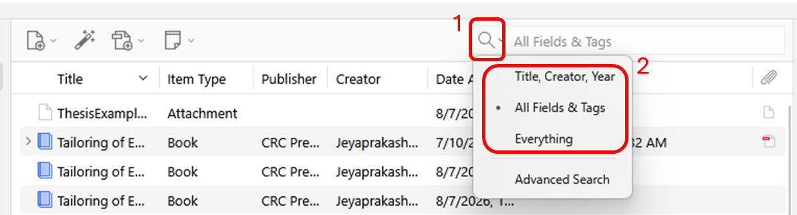

### **Speeding Up Quick Searches[\#](https://www.zotero.org/support/searching#speeding_up_quick_searches)**

By default, the quick search searches automatically as you type. In very
large libraries, this can result in a slow search experience. To speed
things up, type a quotation mark (") mark at the beginning of the search
field. This causes the search to start only when you type Enter/Return.

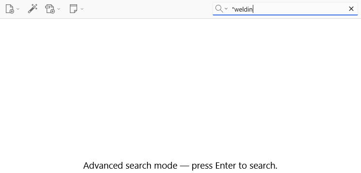

## **Advanced Search[\#](https://www.zotero.org/support/searching#advanced_search)**

Advanced searches offer more and finer control than quick searches, and
allow you to make [saved searches](#saved-searches-1).

### **Running an Advanced Search[\#](https://www.zotero.org/support/searching#running_an_advanced_search)**

To open the Advanced Search window, click on the magnifying glass icon
() at the top of the center
pane and select “Advanced Search”. In this window, you can filter items
by the content of specific fields or by other properties, like item type
or the collection an item belongs to. Multiple filters can be set up by
clicking the plus button.

Set the library to search in by using the “Search in library:” option at
the top of the window. It is not currently possible to search in
multiple libraries at one time.

By default, items only show up in the search results if they satisfy all
search criteria. To change the search so that all items matching at
least one criterion are returned, change the “Match” option to “any”.

You can filter items by the collections or saved searches they belong to
by searching by “Collection”. To include items in subcollections of
matching collections in the search results, check “Search
subcollections”.

To hide non-matching parent items with child items that do match the
search criteria, and to collapse matching parent items with matching
child items, check “Show only top-level items”.

To match search criteria against both parent items and their children,
check “Include parent and child items of matching items”. If this option
is selected and “Match” is set to “all”, parent/child items will still
show up if just part of the criteria is met by the parent item and the
other part by a child item.

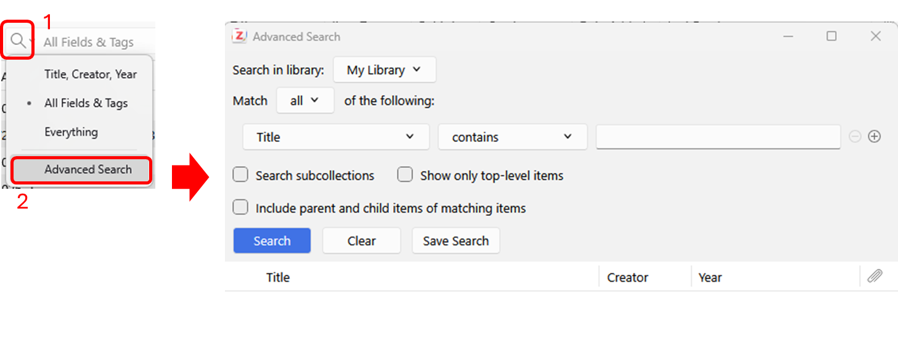

### **Wild Cards[\#](https://www.zotero.org/support/searching#wild_cards)**

The % percent sign character acts as a wild card in advanced searches,
substituting for zero or more characters. For example, the search term
“W% Shakespeare” will match “W Shakespeare”, “W. Shakespeare” as well as
“William Shakespeare”.

To search for items where a field contains any content at all, search
for the % percent sign character alone.

### **Saved Searches[\#](https://www.zotero.org/support/searching#saved_searches)**

When you save an Advanced Search, it appears as a collection in your
library but with a Saved Search icon
() instead of the regular
collection icon
(). Saved Searches are
continuously updated. For example, if you set up a Saved Search for
“Date Added” “is in the last” “7” “days”, the saved search will always
show the items that have been added in the last 7 days. Saved searches
only store the search criteria, not the search results. To save a
search, click the “Save Search” button in the Advanced Search window and
provide a name for the search.

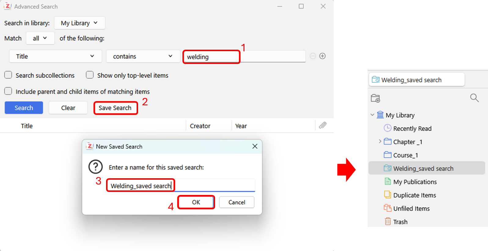

Saved searches can be edited or deleted by right-clicking the Saved
Search and selecting “Edit Saved Search…” or “Delete Saved Search…”,
respectively.

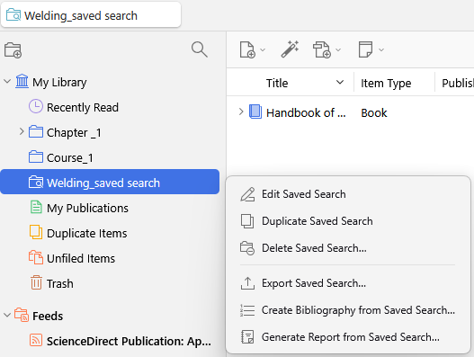

You can also create a saved search in a library by right-clicking on the
library name and choosing “New Saved Search…”.

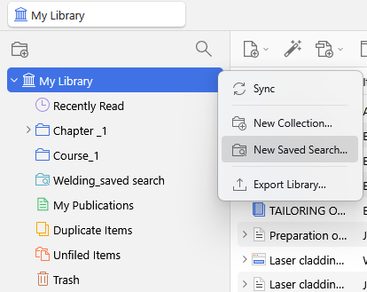

### **Complex Search Criteria[\#](https://www.zotero.org/support/searching#complex_search_criteria)**

It is possible to run complex Boolean searches by using multiple Saved
Searches. For example, to run the search (a OR b) AND (c OR d), first
make a Saved Search called “Condition1” for (a OR b), then make a Saved
Search called “Condition2” for (c OR d). Finally, run a third Advanced
Search and search for "Collection" "is" "Condition1" AND "Collection"
"is" "Condition2".

## **Full-Text Indexing[\#](https://www.zotero.org/support/searching#full-text_indexing)**

Full-text indexing allows embedded text within PDFs, EPUBs, HTML, and
text files to be searched with Quick Search (via the “Everything”
option) and Advanced Search (via “Attachment Content”). Indexing happens
automatically in the background when Zotero is idle.

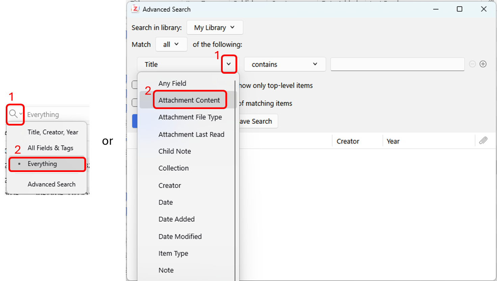

You can control how much text in a PDF/EPUB/HTML/text file is indexed in
the [<u>Search
pane</u>](https://www.zotero.org/support/preferences/search) of
[<u>Zotero preferences</u>](https://www.zotero.org/support/preferences)
(default: 500000 characters, 100 pages). You can remove indexed text
with the “Clear Index…” button or re-create the index from scratch using
the “Rebuild Index…” button. You can check the index status of any
PDF/EPUB/HTML attachment by selecting the attachment item in the Zotero
library and looking at the “Indexed:” field in the right pane.

If an item isn’t being indexed (e.g., if it is not showing up in an
‘Everything’ Quick Search), verify that the item has searchable text and
that the text is properly stored in the PDF (e.g., try to copy text out
of the document and ensure that it is high quality). If the PDF has
valid text, rebuild the item’s index by right-clicking on it and
choosing “Reindex Item”. If you are still having issues, please ask a
question on the [<u>Zotero forums</u>](https://www.zotero.org/forum).

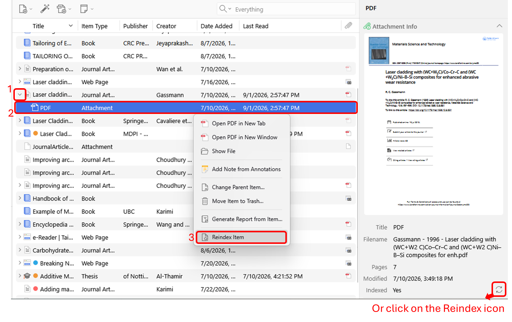**Note:** At this time, only
PDF/EPUB/HTML full text content (and plain text files) can be indexed by
Zotero. Other document types (e.g., .docx, .odt) cannot be indexed by
Zotero.

# **Sorting**

Items in the center pane can be sorted by various fields, such as their
title, creators, or the date they were added to your library.

To change the way items are sorted, click on any of the column headers
at the top of the center pane. For example, if you click on “Title”, all
your items will be sorted alphabetically by title. Clicking a header
multiple times toggles between ascending and descending sorts. (The
header will show an upward and downward arrow, respectively.)

By default, Zotero will show columns for the Title, Creators, and
Attachments properties in the center pane. You can change which fields
are shown by right-clicking on the column headers and selecting fields
from the drop-down menu.

For each column, you can also choose the Secondary Sort field (the field
that’s used to break ties when sorting).

By default, fields in the center pane are arranged from left to right in
the order in which they are shown in the drop-down menu. You can
rearrange them by dragging and dropping the headers. To reset the order,
select “Restore Column Order” in the drop-down menu.

# **Notes**

In addition to items and file attachments, you can also store notes in
your Zotero library: child notes, which belong to a specific item, and
standalone notes. Notes are
[<u>synced</u>](https://www.zotero.org/support/sync) along with item
metadata; they don’t count against your Zotero [<u>file storage
quota</u>](https://www.zotero.org/support/storage).

## Child Notes[\#](https://www.zotero.org/support/notes#child_notes)

To create a child note, select an item in the center pane. Then, either
click the “New Note” button at the top of the center pane
(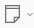) and select “New Item Note”,
or select the “Notes” icon
()in the right-hand pane and
click the plus icon
(). You can also right-click
an item and select “Add Note”.

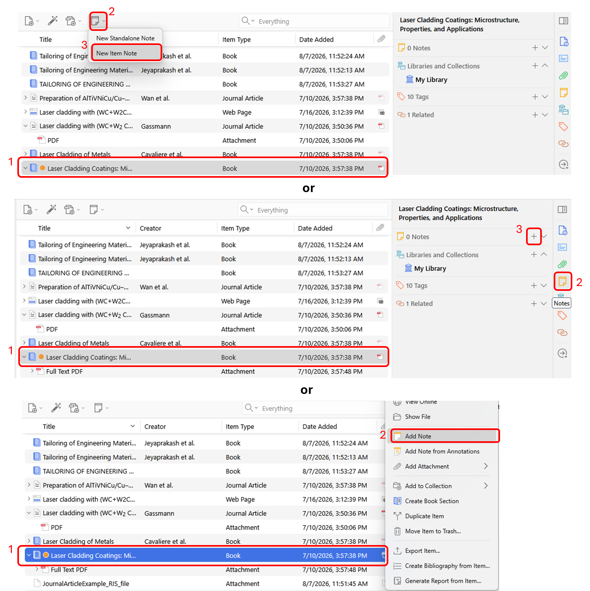A note will be created as an
attachment to the item (it will also show up under the “Notes”), and a
note editor will appear in the right-hand pane. You can create a
dedicated window for the note editor by clicking the “Edit in a separate
window” button at the bottom of the editor. Text in notes is saved as
you type.

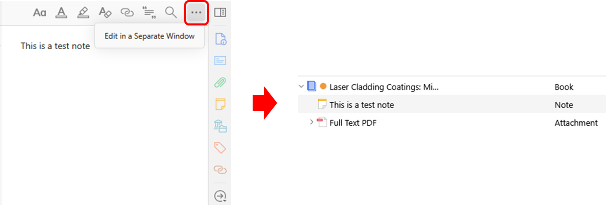

## Standalone Notes[\#](https://www.zotero.org/support/notes#standalone_notes)

Standalone notes work the same as child notes, but are not directly
related to any item in your library. Standalone notes will appear
alongside any other items in your library. To create a standalone note,
click the “New Note”
() button and select “New
Standalone Note”.

## Tagging and Relating[\#](https://www.zotero.org/support/notes#tagging_and_relating)

As with any other item in Zotero, notes or standalone notes can be
[<u>tagged</u>](https://www.zotero.org/support/collections_and_tags) and
[<u>related</u>](https://www.zotero.org/support/related) to other items.
Both features can be accessed via the bottom of the note editor.

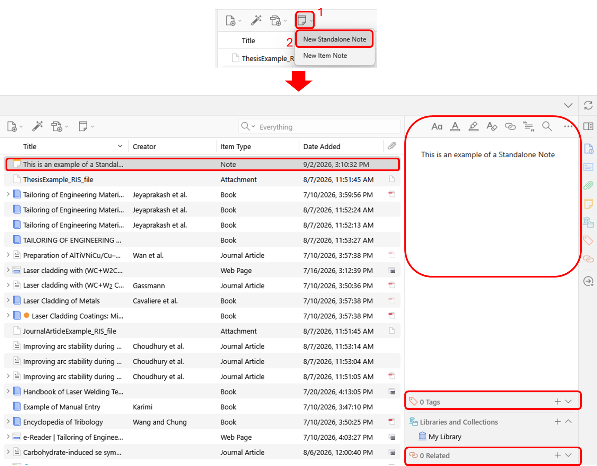

## Searching Notes[\#](https://www.zotero.org/support/notes#searching_notes)

Notes can be searched via the general Zotero
[<u>search</u>](https://www.zotero.org/support/searching). You can
search text within a note using the note editor’s “Find and Replace”
button or Ctrl/Cmd-F.

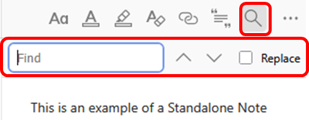

## Images in Notes[\#](https://www.zotero.org/support/notes#images_in_notes)

You can embed images into Zotero notes by dragging them from your
filesystem or, in some cases, by pasting them in. Embedded images sync
between devices and count against your Zotero Storage quota.

# **Zotero PDF Reader and Note Editor**

## **Creating Annotations[\#](https://www.zotero.org/support/pdf_reader#creating_annotations)**

### **Highlights and Underlines[\#](https://www.zotero.org/support/pdf_reader#highlights_and_underlines)**

The reader supports two highlighting/underlining modes. You can use
whichever mode works best for your workflow. In the default, unlocked
mode, with nothing selected in the annotation toolbar, whenever you
select text in the document, a popup will appear with a selection of
colors, and you can click a color to create a highlight or underline on
the selected text.

To quickly make many highlights or underlines, you can turn on locked
mode: click the highlight or underline tool in the toolbar, and then
choose a color using the color-picker button. Then, every time you
select text in the document, a highlight or underline will be
automatically created in the color you’ve picked.

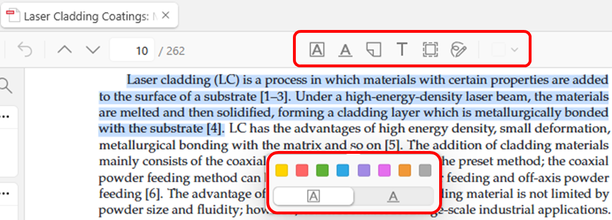

## **Adding Annotations to Notes[\#](https://www.zotero.org/support/pdf_reader#adding_annotations_to_notes)**

You can add annotations to notes in various ways. Annotations added to
notes will automatically include links back to the PDF page as well as
citations that you can later add to a Word, LibreOffice, or Google Docs
document with one of the word processor plugins.

### **In the PDF reader[\#](https://www.zotero.org/support/pdf_reader#in_the_pdf_reader)**

You can easily add annotations to notes right from the PDF reader.
First, use the Notes button in the top-right corner to open the Notes
pane, where you can create a new note or open an existing note.

To create a new note from all annotations in the current PDF, click one
of the “+” buttons and select Add Item Note from Annotations or Add
Standalone Note from Annotations.

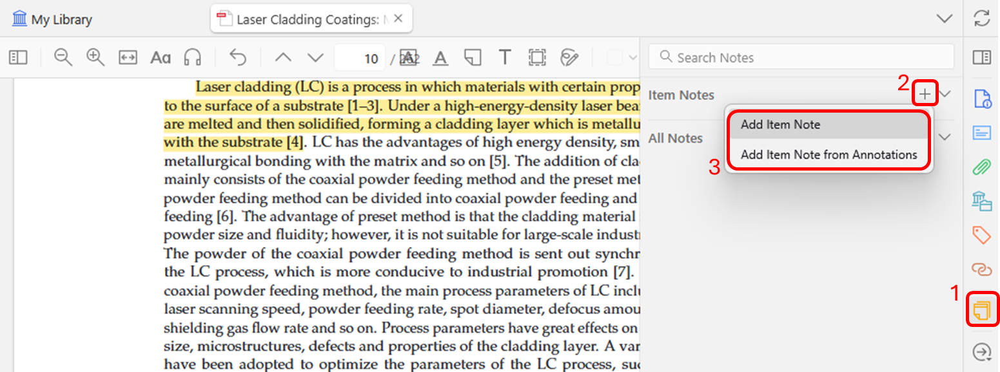

If you already have a note open in the Notes pane, you can drag
individual annotations from the PDF or from Annotations tab in the
left-hand sidebar as you type your note. Alternatively, you can select
one or more annotations in PDF or in the Annotations tab of the
left-hand sidebar, right-click one of the annotations, and select Add to
Note.

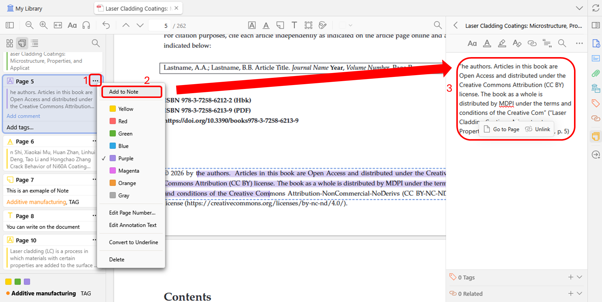

You can also drag annotations from the PDF reader to a note that’s
opened in a separate window. If you’re sure you won’t use a quote more
than once, it’s also possible to add quotes to Zotero notes without
creating an annotation first. Simply select text in the PDF and drag it
to an open Zotero note.

### **In the items list[\#](https://www.zotero.org/support/pdf_reader#in_the_items_list)**

You can create a child note from all annotations in a PDF by
right-clicking on the parent item in the items list and choosing Add
Note from Annotations.

You can also create a standalone note with annotations from multiple
items by selecting the parent items, right-clicking, and choosing Create
Note from Annotations.

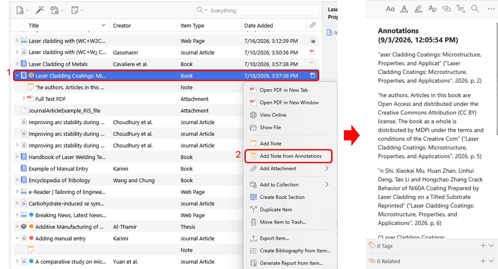

## **Customizing Annotations in Notes[\#](https://www.zotero.org/support/pdf_reader#customizing_annotations_in_notes)**

You can customize how annotations are added to notes by using [<u>note
templates</u>](https://www.zotero.org/support/note_templates).

## **Working with Annotations in Notes[\#](https://www.zotero.org/support/pdf_reader#working_with_annotations_in_notes)**

### **Viewing an Annotation in Context[\#](https://www.zotero.org/support/pdf_reader#viewing_an_annotation_in_context)**

When you add an annotation to a note, it will add both an annotation and
a citation by default.

To view the annotation in context, click the annotation and click “Show
on Page” in the popup that appears. This will open the original PDF in
either the built-in PDF reader or an external PDF reader if you’ve
configured one in the General pane of the preferences. When possible,
Zotero will open the PDF to the page where the annotation was made —
this works for the built-in PDF reader and most, but not all, popular
external PDF readers (e.g., Acrobat on Windows, Preview on macOS, evince
on Linux).

To view the associated item in your library, click the citation and
select “Show Item”.

### **Displaying Annotation Colors[\#](https://www.zotero.org/support/pdf_reader#displaying_annotation_colors)**

To show annotation colors in your note, click the “…” button in the
top-right corner of the note editor and select “Show Annotation Colors”.
You can remove colors later with “Hide Annotation Colors”.

### **Hiding or Showing Citations in the Note[\#](https://www.zotero.org/support/pdf_reader#hiding_or_showing_citations)**

To hide or show all citations in a note, click the “…” button in the
top-right corner of the note editor and select “Hide Annotation
Citations” or “Show Annotation Citations”.

You can hide an individual citation by clicking on it in the editor and
selecting “Hide Citation” from the popup, or simply by deleting the
citation completely. You can add the citation back at any time by
clicking on the highlighted text and selecting “Add Citation” from the
popup or by using “Show Annotation Citations” in the “…” menu.

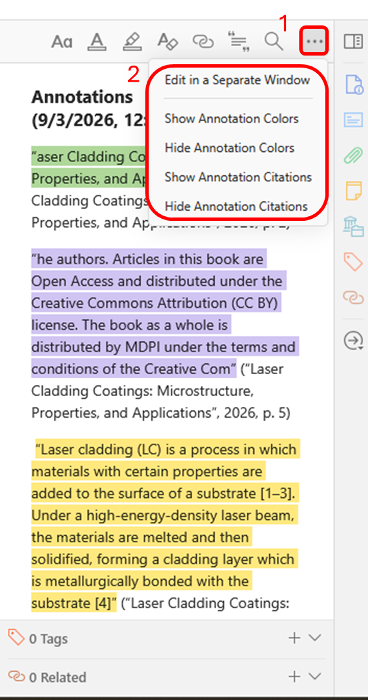

## **Using an External PDF Reader[\#](https://www.zotero.org/support/pdf_reader#using_an_external_pdf_reader)**

If you’d prefer to open PDFs in an external PDF reader, you can choose
one from the General pane of the Zotero preferences.

To open a single PDF in an external reader, right-click on the item and
choose Show File, and then open the PDF from your OS file manager. Some
changes you make in external PDF readers will cause problems in the
built-in reader — e.g., adding, deleting, reordering, or rotating pages
will cause annotations to appear on the wrong page or in the wrong
position. (Pages can be deleted or rotated from the Annotations tab in
the Zotero reader sidebar.)

Note that annotations created in the built-in PDF reader are stored in
the Zotero database, so they won’t be visible in external PDF readers
unless you export a PDF with embedded annotations. See
[<u>Annotations in
Database</u>](https://www.zotero.org/support/kb/annotations_in_database)
for more info.

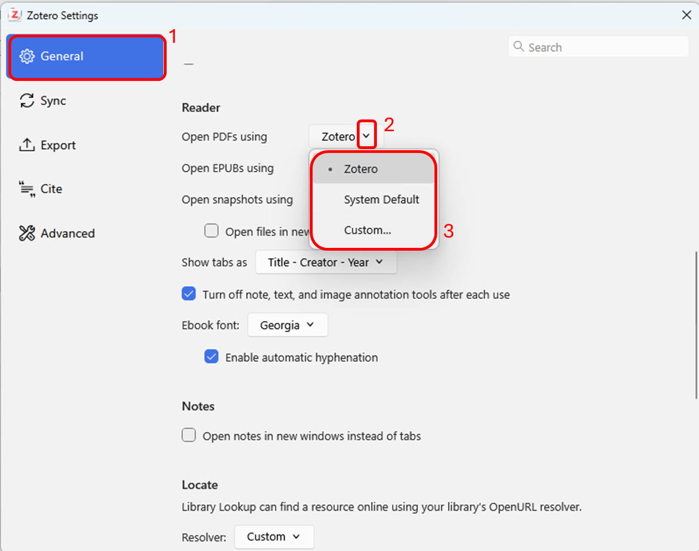

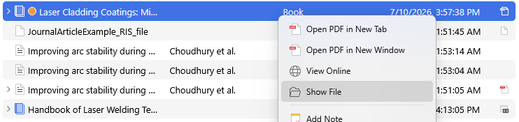

# **Related Items**

In addition to [<u>collections and
tags</u>](https://www.zotero.org/support/collections_and_tags), a third
way to express relationships between items is by setting up “relations”.
Relations can set up between any pair of items in a library (it is not
possible to relate items from different libraries).

To create a relation, select an item in the center pane and go to the
“Related” tab of the right pane. Click the “Add” button, and select one
or more items from the same library in the pop-up window (hold down Ctrl
or Shift \[Windows/Linux\] or Cmd or Shift \[Mac\] to select multiple
items) and click “OK”. The selected items will now show up as related
items in the “Related” tab, and clicking an item will take you straight
to that item.

Note that when you relate item A to B, B will be automatically related
to A. But relations are not transitive: relating A to B, and B to C,
will not automatically relate A to C.

Some suggestions of how you could use this feature:

- connect book chapters to their parent volume

- connect book reviews to the book reviewed

- connect different versions of a work (e.g., connecting a conference
  presentation that eventually became an article that eventually became
  a book)

- link associated items from different collections

- link items that form parts of a single work (e.g., articles in a
  series)

- connect standalone notes to the items they discuss

- link one item to another discussed in the Abstract or Notes fields

- link items that have similar comments in the Abstract or Notes fields

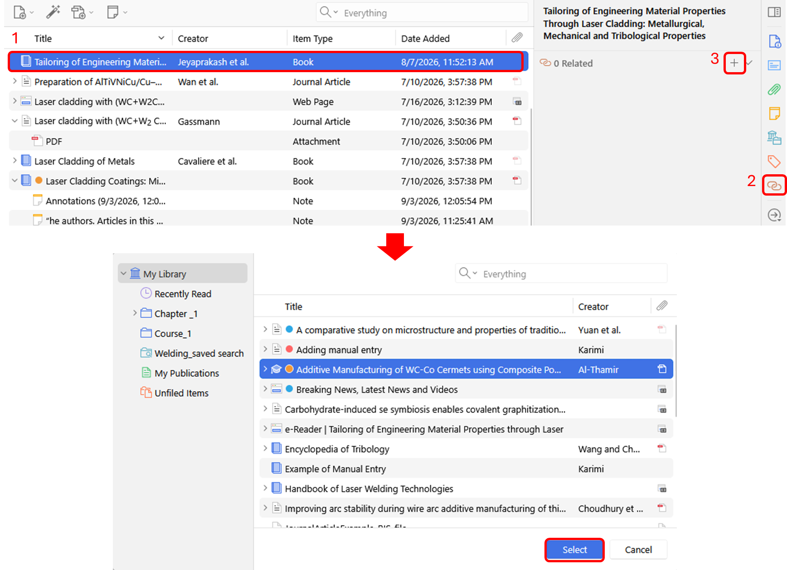

# **Duplicate Detection**

As you build your Zotero library, you might introduce a few duplicated
items. For example, you could have saved the same item twice from a
webpage, or imported items already in your library. Fortunately, Zotero
can help you identify possible duplicates and allow you to merge them.

## **Finding Duplicates[\#](https://www.zotero.org/support/duplicate_detection#finding_duplicates)**

Clicking on the “Duplicate Items” collection in your library will show
the items Zotero thinks are duplicates in the center pane.

Zotero currently uses the title, DOI, and ISBN fields to determine
duplicates. If these fields match (or are absent), Zotero also compares
the years of publication (if they are within a year of each other) and
author/creator lists (if at least one author's last name plus first
initial matches) to determine duplicates. The algorithm will be improved
in the future to incorporate other fields.

At this time, it is not possible to mark false positive matches as
non-duplicates. This functionality will be added in the future.

Note that duplicate detection only works *within a library*. Items in
different group libraries are [<u>separate
items</u>](https://www.zotero.org/support/groups#interact_with_groups_through_the_zotero_client).
They won’t show up in the “Duplicate Items” collection of any one of the
libraries.

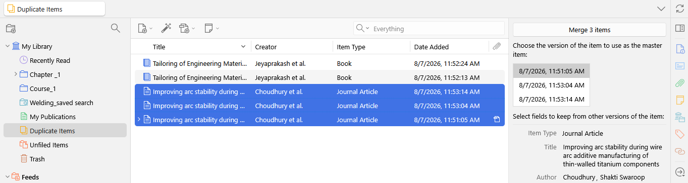

## **Merging Duplicates[\#](https://www.zotero.org/support/duplicate_detection#merging_duplicates)**

You should always resolve duplicate items by merging them, rather than
deleting one of the duplicates. Merges will retain all of the
collections and tags of the merged items; deleting one item will lose
these data. Merges are also automatically recognized by the [<u>word
processor
plugins</u>](https://www.zotero.org/support/word_processor_integration)
and don’t affect your automatically generated citations and
bibliographies.

To merge items in the “Duplicate Items” collection, select an item in
the center pane. Zotero will automatically co-select the other items
that it thinks are duplicates. Click the “Merge \<number\> Items” button
in the right pane to merge the items. If the item fields don’t match
completely, you can select one item to be the “master” from the list at
the top of the right pane, then select alternative versions of
mismatched fields using the icons to the right of each field.

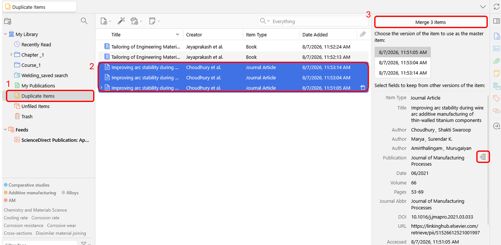

It may be easier to see which items are selected if you [<u>sort the
items by Title</u>](https://www.zotero.org/support/sorting). You can
select a single item in the “Duplicate Items” view by holding down
Alt/Option while clicking. You can de-select an item from a set of
duplicates by holding down Ctrl (Windows/Linux) or Cmd (Mac) while
clicking.

You can also select a group of two or more items *of the same item type*
anywhere in your Zotero library, right-click, and select “Merge Items…”
from the context menu.

# **Creating Bibliographies**

## **Word Processor Integration[\#](https://www.zotero.org/support/creating_bibliographies#word_processor_integration)**

Of the different ways to automatically [<u>generate
bibliographies</u>](https://www.zotero.org/support/creating_bibliographies)
(as well as in-text citations and footnotes), the easy-to-use word
processor plugins are the most powerful. These plugins, which are
available for [Microsoft
Word](https://www.zotero.org/support/word_processor_plugin_usage),
[Google Docs](https://www.zotero.org/support/google_docs), and
[LibreOffice](https://www.zotero.org/support/libreoffice_writer_plugin_usage),
create dynamic bibliographies: insert a new in-text citation in your
manuscript, and the bibliography will be automatically updated to
include the cited item. Correct the title of an item in your Zotero
library and with a click of a button the change will be incorporated in
your documents.

In the following we will only cover Microsoft Word, but the basics
applies if you are using other word processors. [<u>Third-party
plugins</u>](https://www.zotero.org/support/plugins#word_processor_and_writing_integration)
are also available for integrating Zotero with other word processors and
writing systems.

### Zotero Word Plugin

#### Zotero Plugin Tab[\#](https://www.zotero.org/support/word_processor_plugin_usage#zotero_plugin_tab)

[<u>Installing</u>](https://www.zotero.org/support/word_processor_plugin_installation)
the Zotero Word plugin adds a Zotero tab to Microsoft Word. The Zotero
tab contains these icons:

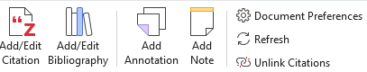

<table style="width:85%;">
<colgroup>
<col style="width: 20%" />
<col style="width: 64%" />
</colgroup>
<thead>
<tr>
<th style="text-align: left;">Add/Edit Citation</th>
<th style="text-align: left;">Add a new citation or edit an existing
citation in your document at the cursor location.</th>
</tr>
</thead>
<tbody>
<tr>
<td style="text-align: left;">Add/Edit Bibliography</td>
<td style="text-align: left;">Insert a bibliography at the cursor
location or edit an existing bibliography.</td>
</tr>
<tr>
<td style="text-align: left;">Add Annotation</td>
<td style="text-align: left;">Add the selected annotation along with its
citation (if any) at the cursor location.</td>
</tr>
<tr>
<td style="text-align: left;">Add Note</td>
<td style="text-align: left;">Add the selected note at the cursor
location.</td>
</tr>
<tr>
<td style="text-align: left;">Document Preferences</td>
<td style="text-align: left;">Open the Document Preferences window, e.g.
to change the citation style.</td>
</tr>
<tr>
<td style="text-align: left;">Refresh</td>
<td style="text-align: left;">Refresh all citations and the
bibliography, updating any item metadata that has changed in your Zotero
library.</td>
</tr>
<tr>
<td style="text-align: left;">Unlink Citations</td>
<td style="text-align: left;">Unlink Zotero citations in the document by
removing the field codes. This prevents any further automatic updates of
the citations and bibliographies. 
Note that removing field codes is <strong>irreversible</strong>, and
should usually only be done in a final copy of your document.</td>
</tr>
</tbody>
</table>

#### 

#### Citing[\#](https://www.zotero.org/support/word_processor_plugin_usage#citing)

You can begin citing with Zotero by clicking the “Add/Edit Citation”
() button. Pressing the button
brings up the citation dialog. The citation dialog is used to select
items from your Zotero library, and create a citation. Note if this is
your first time using Zotero, it usually asks you to select your
citation style (which you can change later using [Document
Preferences](#document-preferencescitation-style)) and then show you the
citation dialog window.

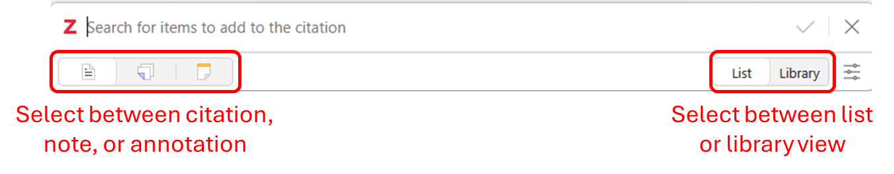

Start typing part of a title, the last names of one or more authors,
and/or a year in the dialog box. Matching items will instantly appear
below the dialog box.

Matching items will be shown for each library in your Zotero database
(My Library and any groups you are part of). Items you have already
cited in the document will be shown at the top of the list under
“Cited”.

Select an item by double-clicking on it or by pressing Enter/Return when
it is highlighted. The item will appear in the dialog box in a shaded
bubble. Press Enter/Return again (or click the check
mark\[\])to insert the citation and
close the Add Citation box.

In the Add Citation dialog box, you can click on the bubble for a cited
item, then click “Show in Library” to view the item in Zotero. Items
that are orphaned (not connected to any items in your Zotero database)
will not have an this option. Orphaned items can exist if they were
inserted by a collaborator from their My Library or a group you don’t
have access to or if you they were deleted from your Zotero library.

#### Document Preferences/Citation Style[\#](https://www.zotero.org/support/word_processor_plugin_usage#document_preferences)

Clicking the “Document Preferences”
(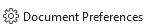) lets you set the following
document-specific preferences:

1.  The [<u>citation style</u>](https://www.zotero.org/support/styles).

2.  The language to use to format citations and bibliography.

3.  For note-based styles (e.g., “Chicago Manual of Style (Note)”),
    whether citations are inserted in footnotes or endnotes.

    1.  Note that Word, not Zotero, controls the style and format of
        footnotes and endnotes.

4.  Whether to store citations as **Fields** or **Bookmarks**.

    1.  Unless you need to collaborate with colleagues using
        LibreOffice, you should always choose Fields.

5.  For styles that abbreviate journal titles (e.g., “Nature”), whether
    to use the **MEDLINE** abbreviations list to abbreviate titles.

    1.  If this option is selected (the default), the contents of the
        “Journal Abbr” field in Zotero will be ignored.

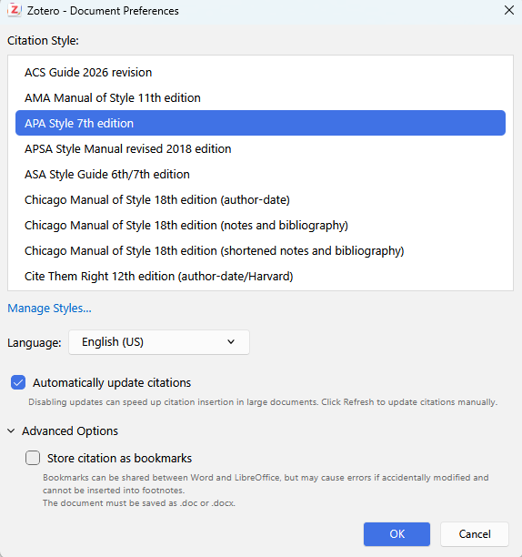

#### Customizing Citations[\#](https://www.zotero.org/support/word_processor_plugin_usage#customizing_citations)

Citations can be customized in various ways.

If a citation is simply incorrect or missing data, start by making sure
that the item metadata in Zotero is correct and complete, and then click
Refresh in the plugin
() to update your document
with any changes.

Other customizations can be made via the citation dialog. Click an
existing citation in your document and click Add/Edit Citation to open
the citation dialog, and then click the citation bubble to open the cite
options window, where you can make the following changes.

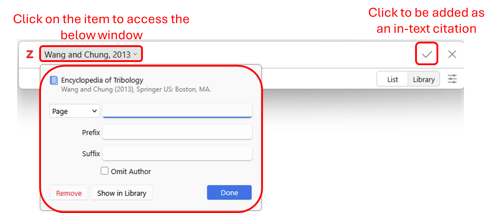

##### **Page and Other Locators[\#](https://www.zotero.org/support/word_processor_plugin_usage#page_and_other_locators)**

In some cases you want to cite a certain part of an item, e.g. a certain
page, page range or volume. This additional cite-specific information
(e.g. “pp. 4-7” in the cite “Doe et al. 2001, p. 4-7”) is called the
“locator”.

The cite options windows has a drop-down list of the different locator
types (“Page” is the default), and a text box in which you can enter the
locator value (e.g. “4-7”). To cite a locator other than the ones listed
(e.g., “Table), use the Suffix field.

You can also add page numbers from the keyboard as you insert citations.
Search for an item and, before or after selecting it, but before
pressing Enter to insert the citation into the document, type “p.34”,
“p34”, or even just “34”. The page number will be added to the citation.

##### **Prefix and Suffix[\#](https://www.zotero.org/support/word_processor_plugin_usage#prefix_and_suffix)**

The “Prefix” and “Suffix” text boxes allow you to specify text to
respectively precede and follow the automatically generated cite.

Any text in the prefix and suffix fields can be formatted with the HTML
tags \<i\> (for italics), \<b\> (bold), \<sub\> (subscript), and \<sup\>
(superscript). For example, typing “\<i\>cf\</i\>. the classic example”
will be displayed as “*cf*. the classic example”.

Prefixes and suffixes can be applied to each item in a citation to
create complex citations. For example: “(see Smith 1776 for the classic
example; Marx 1867 presents and alternate view)”. Modifying citations by
entering text into the Prefix and Suffix fields is always preferable to
directly typing in the citation fields in Word. Manual modifications
will prevent Zotero from automatically updating the citation.

##### **Narrative Citations with Omit Author (“According to Smith (1776)”)[\#](https://www.zotero.org/support/word_processor_plugin_usage#narrative_citations_with_omit_author_according_to_smith_1776)**

With author-date styles, authors are often moved into the text and
omitted from the following parentheses-enclosed citation, e.g.:
“According to Smith (1776), the division of labor is crucial…”. To omit
the authors from the cite, check the “Omit Author” box, which will
result in a cite like “(1776)” instead of “(Smith, 1776)”, and write the
author’s name (“Smith”) as part of the regular text in your document.

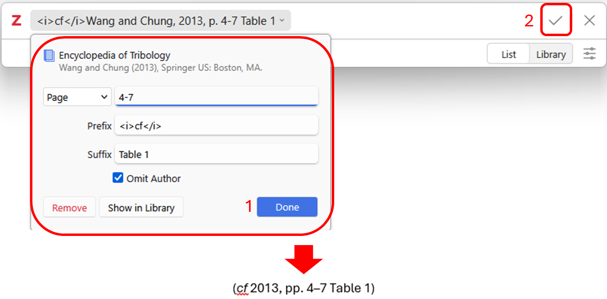

#### **Citations with Multiple Cited Items[\#](https://www.zotero.org/support/word_processor_plugin_usage#citations_with_multiple_cited_items)**

To create a citation containing multiple cites (e.g., “\[2,4-6\]” for
numeric styles or “(Smith 1776, Schumpeter 1962)” for author-date
styles), add them one after the other in the Add Citation box. After
selecting the first item, don’t press Enter/Return, but type the author,
title, or year of the next item.

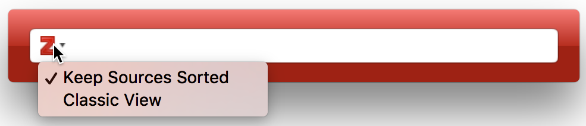

Some citation styles require that items within one in-text citations are
ordered either alphabetically (e.g., “(Doe 2000, Grey 1994, Smith
2008)”) or chronologically (“(Grey 1994, Doe 2000, Smith 2008)”). Zotero
will follow these sort rules automatically.

To disable automatic sorting of the cites in the citation, drag the
citations to rearrange them in the Citation Dialog box. You can also
click the filter icon
() on the bottom right side of
the citation dialog box and uncheck the “Keep Sources Sorted” option.
*This option only appears for citation styles that specify a sort order
for citations.* To restore automatic sorting, re-check the “Keep Sources
Sorted” option.

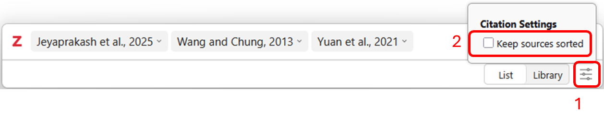

#### **Other Changes[\#](https://www.zotero.org/support/word_processor_plugin_usage#other_changes)**

If your citation still isn’t displaying the way you want, you can edit
the citation directly in your document, but note that doing so will
prevent Zotero from being able to automatically update the citation to
reflect other changes in the document (e.g., for ‘ibid.’ or given name
disambiguation). After you make a manual edit, Zotero will ask you to
confirm that you want to keep the edit and prevent the citation from
being updated automatically going forward. It may be preferable to
instead make notes in the text of changes you want to make, wait until
you’re ready to submit the document, and make the changes in a copy of
the document after using Unlink Citations.

If you believe there’s an error in a citation style, post to the [Zotero
Forums](https://forums.zotero.org/discussions) so that we can
investigate and, if necessary, correct the style. If a style is updated,
your document will automatically update to reflect any changes the next
time you refresh the document.

#### Bibliography[\#](https://www.zotero.org/support/word_processor_plugin_usage#bibliography)

Clicking the “Add/Edit Bibliography” button
() inserts a bibliography at
the cursor location. As you use the plugin, Zotero will automatically
update the bibliography based on the citations in the document.

If you want to add items to the bibliography that you haven’t cited in
the document, click “Add/Edit Bibliography” again to open the
[bibliography
editor](https://www.zotero.org/support/word_processor_plugin_usage#editing_the_bibliography).
You can then use the arrows to add or remove items.

While you can also edit the text or formatting of individual
bibliography entries in this window, doing so is not recommended. Any
manual changes made to the bibliography in Word may be overwritten the
next time Zotero refreshes the document. In addition, manually edited
references will not automatically reflect changes made to the
corresponding items in your Zotero library, and such modifications may
not always persist when the document is refreshed.

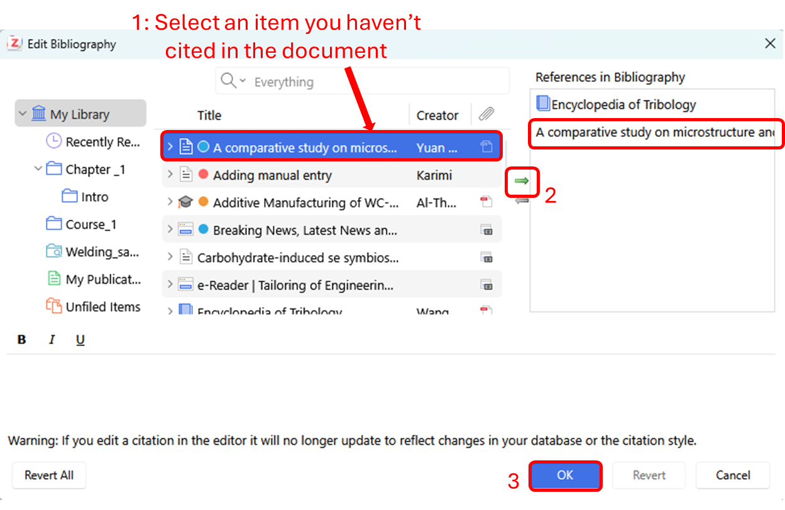

If you need to edit items in your bibliography, it is best to do this as
a final step before submitting the document. First, save a backup copy
of the document. Then, click the “Unlink Citations” button
() to disconnect your document
from Zotero and convert all citations and the bibliography to regular
text. Finally, make your adjustments to the bibliography text.

This process can be used for a variety of minor modifications to the
bibliography, including:

- Adding asterisks \* before references included in a review or
  meta-analysis

- Setting the names of particular authors in bold, italics, or all caps

- Adding annotations or comments about an item

- Adding headings for bibliography subsections (e.g., primary versus
  secondary sources)

**Note:** General corrections to style formatting should be made in the
[<u>CSL Citation Style</u>](https://www.zotero.org/support/styles), not
here. Corrections to item data should be made in your Zotero library,
not here.

#### Keyboard Commands[\#](https://www.zotero.org/support/word_processor_plugin_usage#keyboard_commands)

The Zotero Word plugin can be used with just the keyboard for improved
accessibility and faster use.

- [<u>Keyboard
  shortcuts</u>](https://www.zotero.org/support/word_processor_plugin_shortcuts)
  can be set up for all the buttons in the Zotero tab.

- In the Citation dialog

  - Use the up and down arrow keys to move between search results. Press
    Enter to select an item.

  - Type “p.45-48” or “:45-48” after a citation to cite a specific page
    or page range.

  - Type “ibid” to automatically select the last cited work. This works
    with all citation styles, regardless of whether “ibid” is actually
    used in citations. If you use Zotero in a language other than
    English, use the corresponding abbreviation instead of ibid., e.g.
    “ebd.” in German.

  - Select a citation with the mouse or left/right arrow keys and press
    down arrow or space bar to open the cite options dialog. Use Tab and
    Shift-Tab to move between the different elements, use the up and
    down arrow keys to change the locator type in the locator drop-down
    list, and the space bar to toggle the “Omit Author” checkbox.

#### 

#### Troubleshooting[\#](https://www.zotero.org/support/word_processor_plugin_usage#troubleshooting)

If you run into problems while trying to use the Zotero Word plugin,
make sure to check out the [<u>word processor plugin
troubleshooting</u>](https://www.zotero.org/support/word_processor_plugin_troubleshooting)
page. It the problem still not resolved, reach out to citation
management team for help.

## **\#OPTIONAL\_ Quick Copy[\#](https://www.zotero.org/support/creating_bibliographies#quick_copy)**

If you just want to quickly add references to a paper, email, or blog
post, Zotero’s Quick Copy is the easiest way to go. Simply select items
in the center column and drag them into any text field. Zotero will
automatically create a formatted bibliography for you. To copy citations
instead of references, hold down Shift at the start of the drag.

To configure your Quick Copy preferences, open the Zotero
[<u>settings</u>](https://www.zotero.org/support/kb/preferences) and
select
[<u>Export</u>](https://www.zotero.org/support/preferences/export). From
this tab you can do the following:

- Select the export format

- Set up site-specific export settings

- Choose whether you want Zotero to include HTML markup when copying

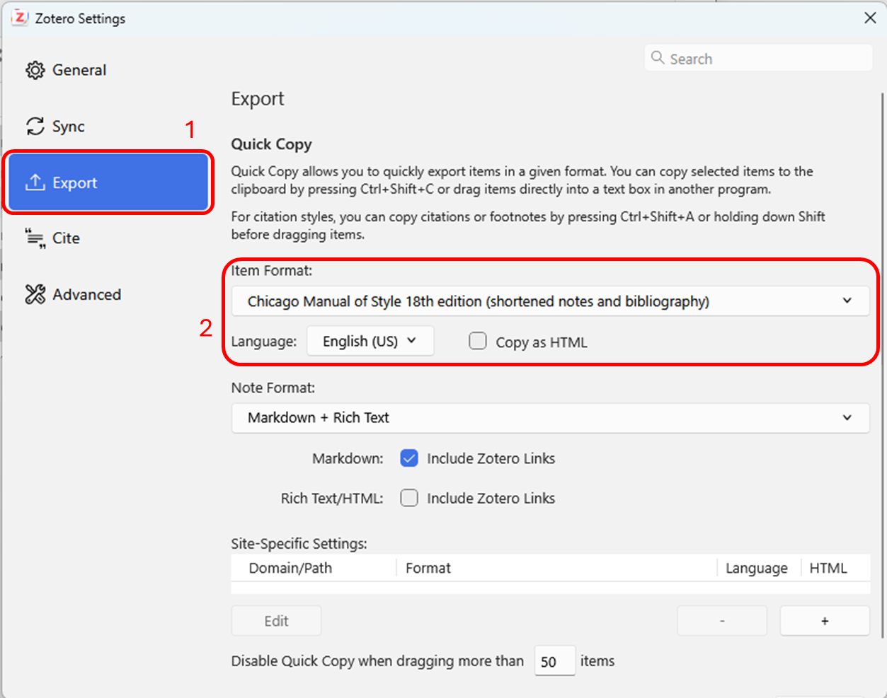

You can also use Edit → Copy Bibliography or press Ctrl/Cmd-Shift-C to
copy bibliography entries to your system clipboard and then paste them
into documents. To copy citations instead of bibliography entries, use
Edit → Copy Citation or Ctrl/Cmd-Shift-A.

In addition to bibliographic output, Quick Copy also supports export
formats such as BibTeX and RIS.

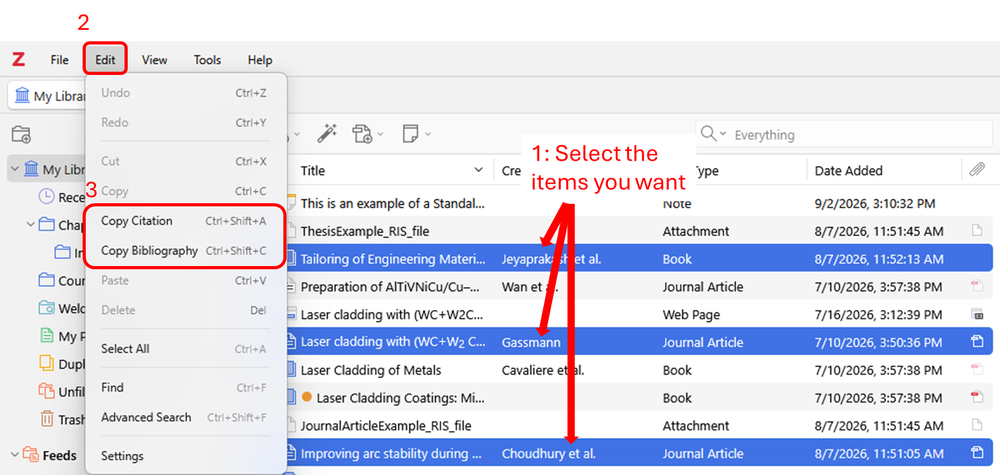

## **\#OPTIONAL\_ Right-Click to Create Citation/Bibliography[\#](https://www.zotero.org/support/creating_bibliographies#right-click_to_create_citationbibliography)**

To create a bibliography or a citations list in Zotero, highlight one or
more items, right-click them, and select “Create Bibliography from
Item(s)…”. Then select a citation style for your citation/bibliography
format and choose either to create a list of *Citations/Notes* or a
*Bibliography*. Then choose one of the following four ways to create
your citation/bibliography:

- *Save as RTF* will save the bibliography as a rich-text file.

- *Save as HTML* will save the bibliography as an HTML file for viewing
  in a web browser. This format will also embed metadata allowing other
  Zotero users viewing the document to capture bibliographic
  information.

- *Copy to Clipboard* will copy the bibliography to your clipboard for
  pasting into any text field.

- *Print* will send your bibliography straight to a printer.

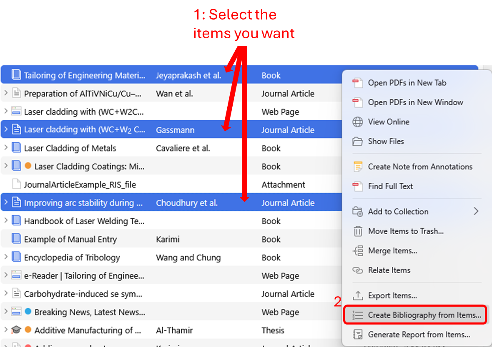

# **Zotero Groups**

Zotero groups provide a powerful way to share collections with a class,
work closely with colleagues on a project, keep track of conversations
in your field more broadly, and keep tabs on what people at your
institution or in your department are working on. There is no limit on
how many members may join your groups, and your full storage
subscription is always available to your personal and group libraries.

Group Libraries are separate from your personal My Library, so you can
also use Zotero groups as a way to keep separate libraries within one
Zotero profile.

## **Creating Groups[\#](https://www.zotero.org/support/groups#creating_groups)**

To create a Zotero group in the Zotero Desktop App, go to File → New
Group... Alternatively, you can click “Create a New Group**”** on the
[Groups landing page](https://www.zotero.org/support/groups) on
Zotero.org. Then, select your preferred **Group Type** and click
**“Create Group.”**

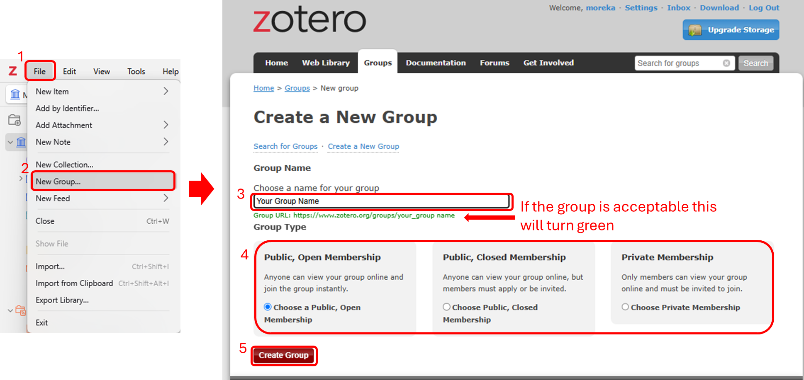

## **Group Types[\#](https://www.zotero.org/support/groups#group_types)**

### **Private Groups[\#](https://www.zotero.org/support/groups#private_groups)**

- Private groups provide a means of collaboration among group members
  without creating any public face for the group online.

- Only group members and users invited to join the group are able to see
  the group’s page.

- Private groups are completely hidden from group searches. They are not
  shown on members’ public profile pages and will not appear in search
  engine results.

- If administrators enable file sharing, group members can access and
  share files in addition to references.

### **Public, Closed Membership[\#](https://www.zotero.org/support/groups#public_closed_membership)**

- Closed-membership groups are useful for creating a controlled group
  environment with a public presence. This allows a group to publicly
  present its work and sources, or develop new membership in a
  controlled fashion.

- Anyone can view the group page, but the only way to join the group is
  by invitation or by requesting an invitation.

- If the group has a library, administrators can choose to show or hide
  the library from non-members.

- If administrators enable file sharing, group members can access and
  share files in addition to references.

### **Public, Open Membership[\#](https://www.zotero.org/support/groups#public_open_membership)**

- Open public groups are useful for the broadest discussion and
  collaboration.

- The group page is public, and anyone who wants to can join instantly.

- If the group has a library, administrators can choose to show or hide
  the library from non-members.

- Open public groups do not allow file sharing.

## **Group Settings[\#](https://www.zotero.org/support/groups#group_settings)**

### **Group Profile Settings[\#](https://www.zotero.org/support/groups#group_profile_settings)**

This page allows you change the group’s name, description, academic
discipline, and group type (private/public, open/closed). You can also
add a group profile picture, give a URL for a webpage about the group,
and enable/disable comments.

To transfer group ownership to another user, use the “Transfer
Ownership” option from this page. Only the group owner can initiate
transferring ownership. If the member offered accepts ownership, they
will become the new group owner (and any group file storage will start
to count against their storage quota).

Group owners can also delete the group from this page.

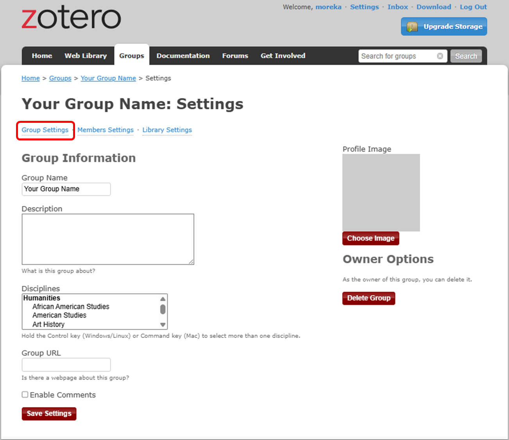

### **Members Settings[\#](https://www.zotero.org/support/groups#members_settings)**

There are three roles for users in groups: regular members,
administrators, and group owners. Administrators can change a group’s
public/private status, members’ roles, and group library settings. Group
owners have all the same privileges as administrators, but can also
delete the group or transfer ownership to another member.

If group file storage is enabled, it will count against the owner’s
storage quota. Other group members’ storage quotas will not be affected
by the group files.

If this is a group for a team, lab, or organization, we recommend
setting up a separate account for the team to function as the owner of
the group, with at least two people knowing the login information. This
way, you will not be locked out of the group if the group owner were to
leave the team or organization.

To invite new group members, click the “Send More Invitations” link at
the bottom of this page. Pending invitations can also be cancelled from
this page.

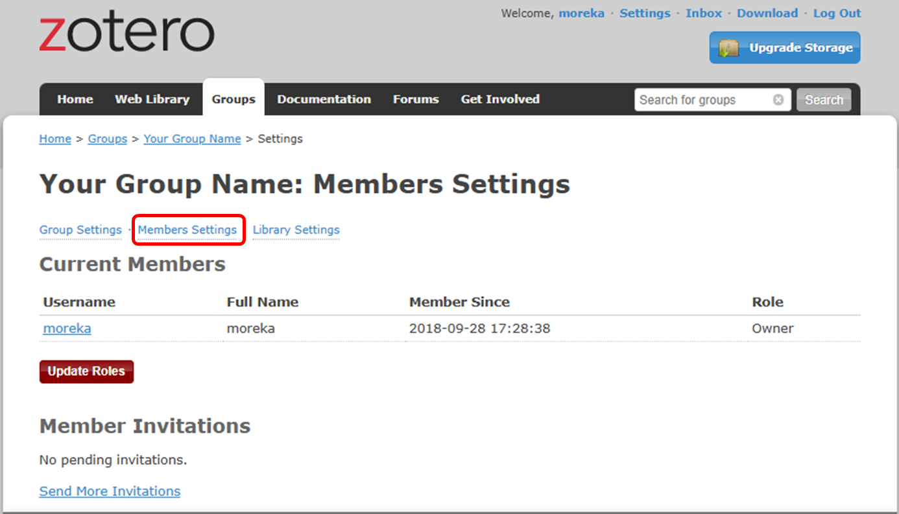

### **Library Settings[\#](https://www.zotero.org/support/groups#library_settings)**

**Group Type** The group type (private/public, open/closed) can be
changed from this page.

**Library Reading** (Who can see items in this group’s library?):

- Anyone on the internet

- Any group member


**Library Editing** (Who can add, edit, and remove items from this
group’s library?):

- Any group member


- Only group admins

**File Editing** (Who can work with files stored in the group? Public
Open groups cannot have file storage enabled.):

- Any group member


- Only group admins

- No group file storage

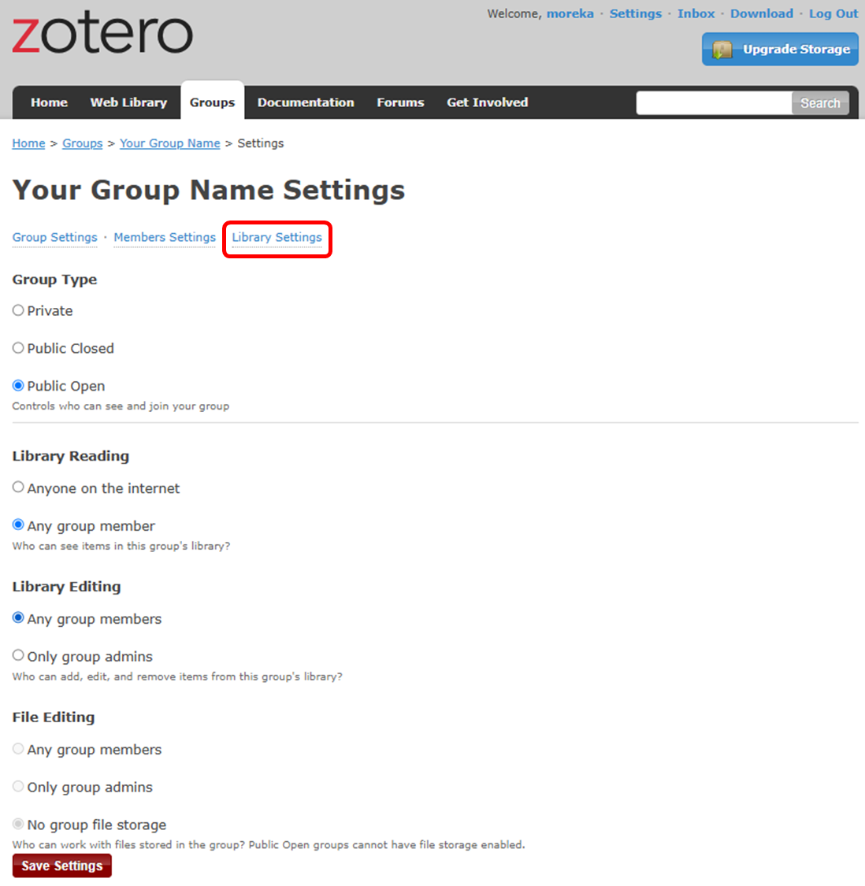

## **Interact With Groups Through the Zotero Client[\#](https://www.zotero.org/support/groups#interact_with_groups_through_the_zotero_client)**

If you have [<u>enabled data
syncing</u>](https://www.zotero.org/support/sync#data_syncing) and are a
member of a group with an enabled library, the group library will appear
in Zotero’s left pane. Items can be dragged into a group from My Library
or another group and viewed or edited by other group members, if their
permissions allow it. To create a collection, right-click on a group
library and select “New Collection…” or “New Saved Search…”.

Note that group libraries are wholly separate from My Library. Any items
dragged into them are separate copies and changes to the items will not
be reflected in your own copy of the item until you drag it back into My
Library.

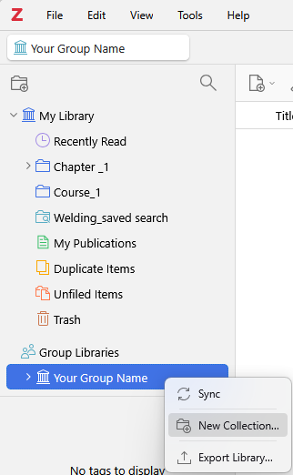

## 

## **\#OPTIONAL\_ RTF Scan[\#](https://www.zotero.org/support/creating_bibliographies#rtf_scan)**

With [<u>RTF Scan</u>](https://www.zotero.org/support/rtf_scan), you can
write in plain text, and use Zotero to finalize your citations and
bibliographies in the style you want.

# **\#OPTIONAL_Citation Styles**

Zotero ships with several popular citation styles for [<u>creating
citations and
bibliographies</u>](https://www.zotero.org/support/creating_bibliographies),
and over 10,000 additional styles can be found in the [<u>Zotero Style
Repository</u>](https://www.zotero.org/styles). All these styles are
written in the [<u>Citation Style
Language</u>](https://citationstyles.org/) (CSL), a format also
supported by many other programs.

## **Installing Additional Styles[\#](https://www.zotero.org/support/styles#installing_additional_styles)**

### **Zotero Style Repository[\#](https://www.zotero.org/support/styles#zotero_style_repository)**

You can install styles from the Zotero Style Repository by going to the
Cite pane of the Zotero settings and clicking on the “Get additional
styles…” option in the [<u>Zotero Style
Manager</u>](https://www.zotero.org/support/preferences/cite). Search
for the style you want and click the style title to install it into
Zotero. You can also visit the [<u>Zotero Style
Repository</u>](https://www.zotero.org/styles) webpage in your browser
with the Zotero Connector installed to install styles directly into
Zotero.

The repository allows you to search by style name and filter by style
type and academic field of study. By checking the box “Show only unique
styles”, duplicate styles that share the exact same format are hidden
(e.g., for the journal-specific styles “Nature”, “Nature Biotechnology”,
“Nature Chemistry”, etc., only the *independent* “Nature” style is
shown).

### **Alternative Installation Methods[\#](https://www.zotero.org/support/styles#alternative_installation_methods)**

You can also install CSL styles (with a “.csl” extension) from local
files on your computer (e.g., styles that you edit yourself or that you
download from another website). In the [<u>Zotero Style
Manager</u>](https://www.zotero.org/support/preferences/cite), click the
‘+’ button, then find the style file on your computer.

## **Managing and Editing Styles[\#](https://www.zotero.org/support/styles#managing_and_editing_styles)**

You can remove installed styles by clicking the ‘-’ button in the
[<u>Zotero Style
Manager</u>](https://www.zotero.org/support/preferences/cite). From this
tab, you can also preview style output for the selected items in Zotero
and [<u>edit installed
styles</u>](https://www.zotero.org/support/dev/citation_styles).

## **Reporting Style Errors[\#](https://www.zotero.org/support/styles#reporting_style_errors)**

If a CSL style doesn’t give the expected output, first make sure that
you are running the latest version of Zotero and have the most recent
version of the style installed from the [<u>Zotero Style
Repository</u>](https://www.zotero.org/styles). Once you have made sure
that the style deviates from the style guide, instructions for authors,
or published examples, report the error in the [<u>Zotero
Forums</u>](https://www.zotero.org/forum). For your post, use the title
“Style Error: \[Name of style\]”, and give a link to, or excerpt from,
the style guide that shows that the CSL style is wrong. You can also try
to [<u>edit the
style</u>](https://www.zotero.org/support/dev/citation_styles/style_editing_step-by-step)
yourself.

## **Requesting New Styles[\#](https://www.zotero.org/support/styles#requesting_new_styles)**

If you can’t find the style you’re looking for in the [<u>Zotero Style
Repository</u>](https://www.zotero.org/styles), feel free to [<u>request
a
style</u>](https://github.com/citation-style-language/styles/wiki/Requesting-Styles).
When requesting styles, please provide formatted references for the
Campbell/Pedersen article and the Mares chapter listed on the linked
page. Please also provide a link to a free-to-access article using the
style (if available). You can also try to [<u>create the
style</u>](https://www.zotero.org/support/dev/citation_styles) yourself.

## \#OPTIONAL\_ Importing from Other Reference Managers

It’s easy to migrate your data from other reference management tools to
Zotero. Instructions for popular tools are linked below.

- [<u>Mendeley</u>](https://www.zotero.org/support/kb/mendeley_import)

- [<u>EndNote</u>](https://www.zotero.org/support/kb/endnote_import)

- [<u>Citavi</u>](https://www.zotero.org/support/kb/import_from_citavi)

- [<u>Microsoft Word Bibliography
  XML</u>](https://www.zotero.org/support/kb/importing_formatted_bibliographies)

- [<u>Plain text reference
  lists</u>](https://www.zotero.org/support/kb/importing_formatted_bibliographies)

- [<u>Bib(La)TeX</u>](https://www.zotero.org/support/kb/importing_standardized_formats)

- [<u>JabRef</u>](https://www.zotero.org/support/kb/importing_standardized_formats)

You can also import from other tools, such as Reference Manager,
RefWorks, Papers, Google Scholar Library, ReadCube, etc., by exporting
to a [<u>standardized reference
format</u>](https://www.zotero.org/support/kb/importing_standardized_formats),
such as RIS, BibTeX, or CSL JSON, and then importing into Zotero by
clicking File → “Import…” and choose “A file”.

If you already have data in a Zotero library on another computer,
[<u>follow these
instructions</u>](https://www.zotero.org/support/kb/transferring_a_library)
to transfer your library to your new computer.
